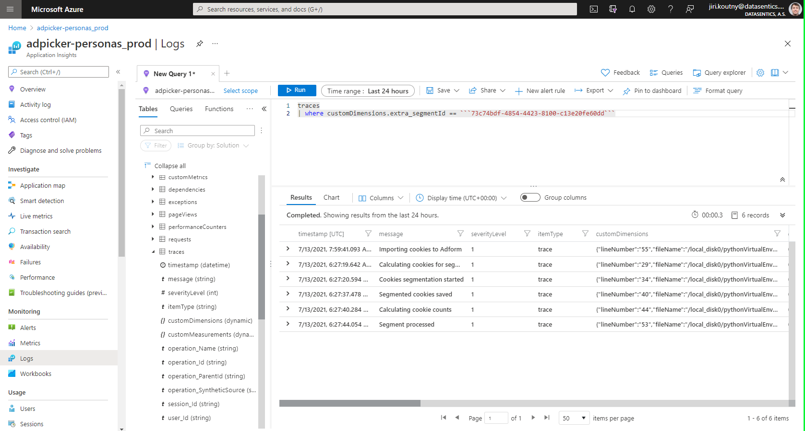

# Logging into Azure setup

The __Azure logger bundle__ package allows you to save logs from your Daipe project into __Azure Application Insights__ which persists your project's logs in a queryable and visualizable way. That allows you to monitor your application's progress and health with ease.

### Installation

```bash
poetry add azure-logger-bundle
```

### Usage

Get the __instrumentation key__


In your project's `src/[ROOT_MODULE]/_config/config.yaml`

```yaml
parameters:
  azureloggerbundle:
    enabled: True
    app_insights:
      instrumentation_key: xxxx-xxxx-xxxx-xxxx
```

or use an environment variable

```yaml
      instrumentation_key: "%env(MY_SECRET_ENV)%"
```

### Logs example


