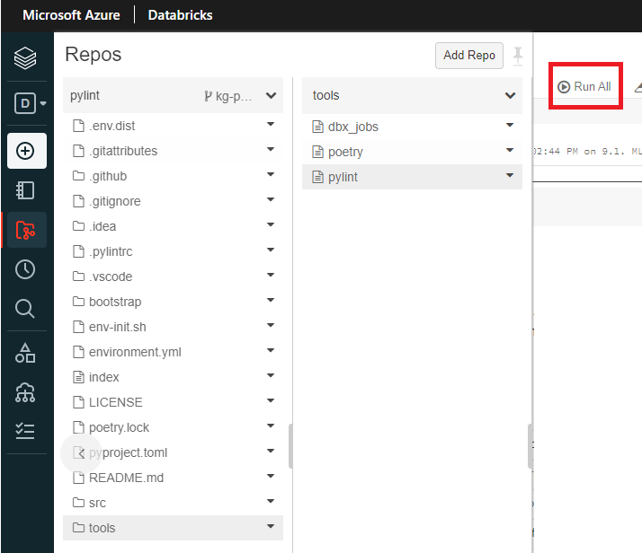
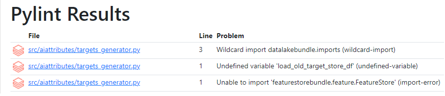
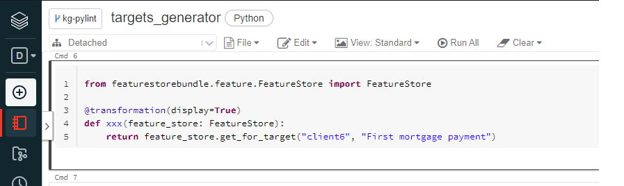
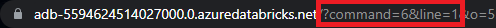

# Checking coding standards

Checking that code you write meet some standards is a very common thing in
software development. Unfortunately it's not that easy to perform this task
in Databricks notebook environment. And that's why pylint for Databricks was
created.

## Why

- Better readability - if everyone follows same standards it's easier to
  read code after someone else
- Early problem detection - linting tools like pylint can discover issues like
  missing import or undefined variable pretty easily
- Productivity - Using linting tools leads to better productivity, maybe it
  doesn't seem that way at first but in long run after people get used to it,
  it really does

## Prerequisites

If you have existing project all you need to do is

- Make sure you have pylint in your development dependencies in [pyproject.toml](https://github.com/daipe-ai/skeleton-databricks/blob/master/pyproject.toml)
- Make sure to use `benvy` `1.3.1` and higher in [install_benvy notebook](https://github.com/daipe-ai/skeleton-databricks/blob/master/bootstrap/install_benvy.py)
- Import [pylint notebook](https://github.com/daipe-ai/skeleton-databricks/blob/master/tools/pylint.py) to your tools directory in your daipe project

In new daipe projects everything above is already setup

## How to use it

There are two main ways to use pylint

### User flow

As a user you write a normal notebook code.

If you want to check your code with pylint, you just go to the `tools/pylint`
notebook and click `Run All`. And that's it.




When the notebook finishes you should see pylint results at the bottom
of notebook.



You can click on the problematic notebooks/files, and you will be automatically
redirected to the exact cell with the problem.

You can see that pylint tells me that it can't import FeatureStore from
featurestorebundle because it is not installed. So it will also detect 
missing dependencies in your `pyproject.toml`.



If you forget where the problem was you don't have to go back to pylint
notebook. We included hint in the redirect URL where you can see the cell
and line number where the problem is.



### CI/CD flow

As always people are not as reliable as computers in performing automated
tasks. And that's why you should also enable additional linting check in
your CI/CD pipeline.

If you are using our centralized Github CI/CD pipelines it is pretty easy to
enable linting check. Just enable pylint in your [build pipeline](https://github.com/daipe-ai/skeleton-databricks/blob/master/.github/workflows/dev.yml)
like that.

```yaml
jobs:
  build:
    uses: daipe-ai/daipe-project-ci-cd/.github/workflows/build.yml@v1
    with:
      pylint_enabled: true
```
