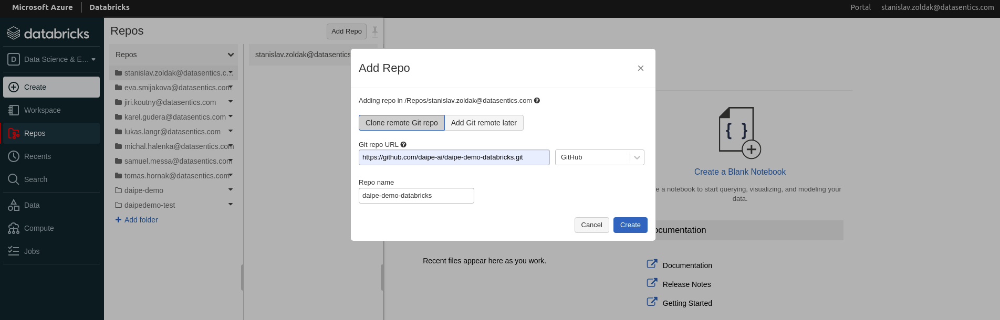

# Get the Daipe demo project

!!! info "Prerequisites"
      - Enable 'Files in Repos' in your Databricks workspace at *Settings -> Admin Console -> Workspace Settings*
      - Set up a GitHub [personal access token](https://docs.github.com/en/authentication/keeping-your-account-and-data-secure/creating-a-personal-access-token)
         - In your Databricks workspace at *Settings -> User Settings -> Git Integration* select GitHub as a provider and use your new token here

1. Log into your Databricks Workspace

2. Under Repos open your personal folder and press "Add Repo" and enter the Url:
     - ```https://github.com/daipe-ai/daipe-demo-databricks.git```

