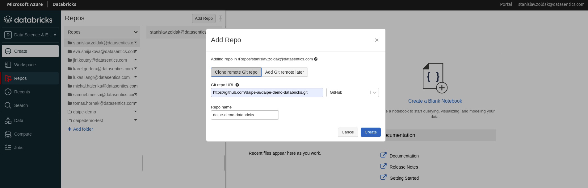

# Get the Daipe demo project

!!! info "Prerequisites"
      - Enable 'Files in Repos' in your Databricks workspace at *Settings -> Admin Console -> Workspace Settings*

1. Log into your Databricks Workspace

2. Under Repos open your personal folder and press "Add Repo" and enter the Url:
     - ```https://github.com/daipe-ai/daipe-demo-databricks.git```

