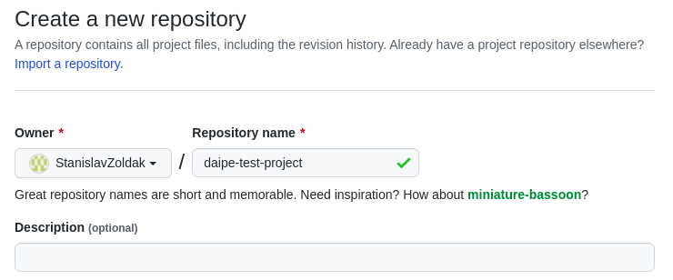
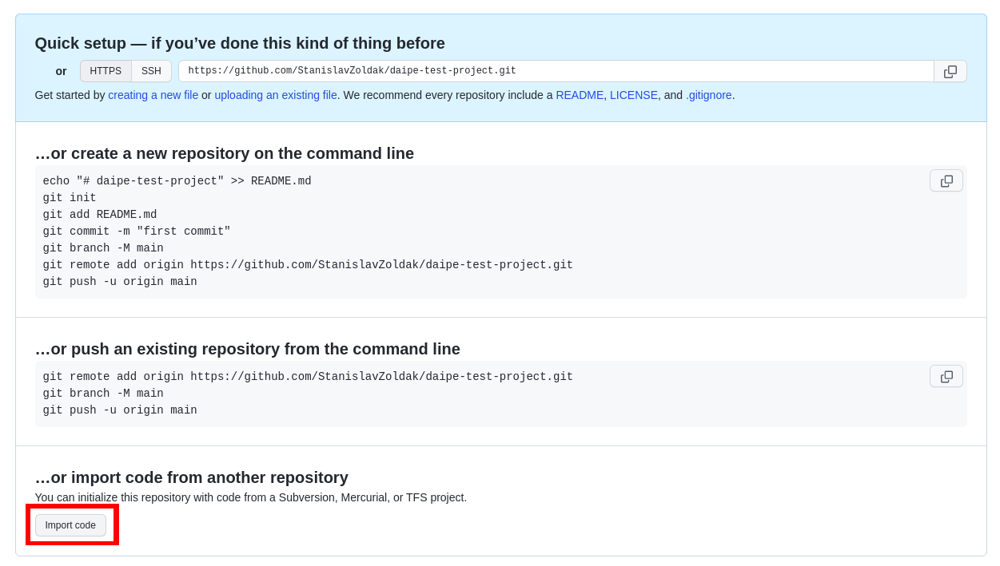
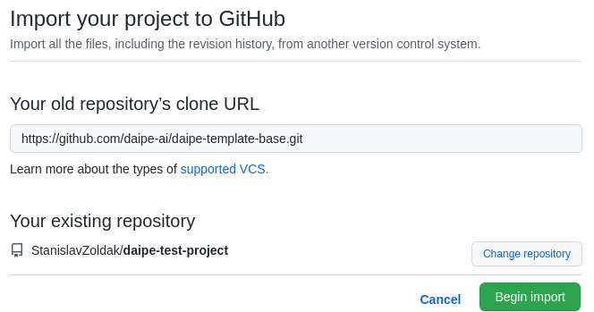

# Creating project from template

!!! info "Prerequisites"
      - Enable 'Files in Repos' in your Databricks workspace at *Settings -> Admin Console -> Workspace Settings*
      - Set up a GitHub [personal access token](https://docs.github.com/en/authentication/keeping-your-account-and-data-secure/creating-a-personal-access-token)
         - In your Databricks workspace at *Settings -> User Settings -> Git Integration* select GitHub as a provider and use your new token here

1. Create a new repository on GitHub:


2. After creating a repo, press Import on the bottom of the page:


3. Select one of the available Daipe templates and confirm:

     - Available templates:
        - ```https://github.com/daipe-ai/daipe-template-base.git```
        - ```https://github.com/daipe-ai/daipe-template-feature-store.git```


4. Your Daipe project is ready to be cloned to Databricks:

