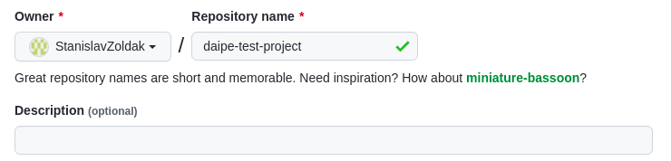
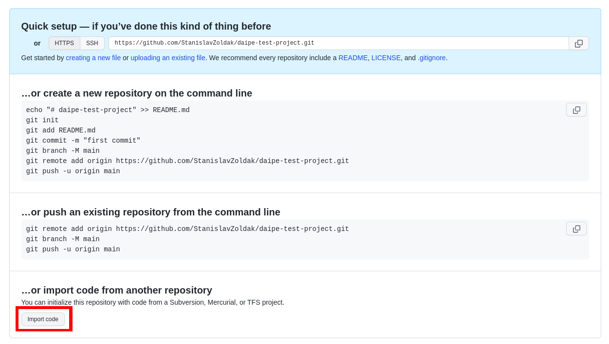
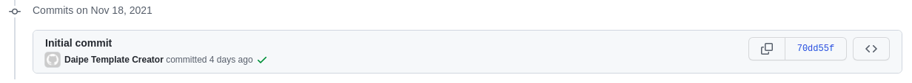

# Creating project from template

1. Create a new repository on GitHub or any other GIT provider:

2. After creating a repo, press Import on the bottom of the page:

3. Fill the URL of any [Daipe project templates](daipe-project-templates.md) and confirm:

5. Your Daipe project is ready to be cloned to Databricks:

