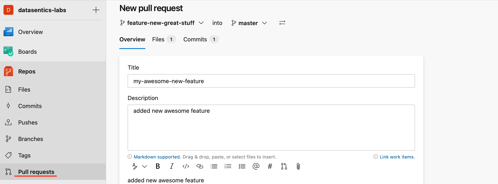

# Creating a Pull Request

When you're done with all the changes create a Pull Request from your branch to the master branch.

When the Pull Request is created the CICD pipeline is automatically triggered and the Databricks notebooks and associated DataFactory Pipelines are deployed to the TEST environment.

There will be newly created DataFactory instance based on the name of the feature branch, you can find the link in the DevOps Pipelines - Deploy Data Factory to test environment.

**To run tests:** 

- Open the TEST Data Factory
- Go to Author Section
- Select the pipeline you updated (or any other pipeline you want to testify is functional) and hit Debug 

After the successful run of the tests add the Reviewer to the Pull Request and provide him with the test results (for instance, by adding a comment to the PR).

When it's approved the PR could be merged by Squash commit to the master and the new awesome feature is automatically deployed to the DEV and with approval to the PROD environments.
