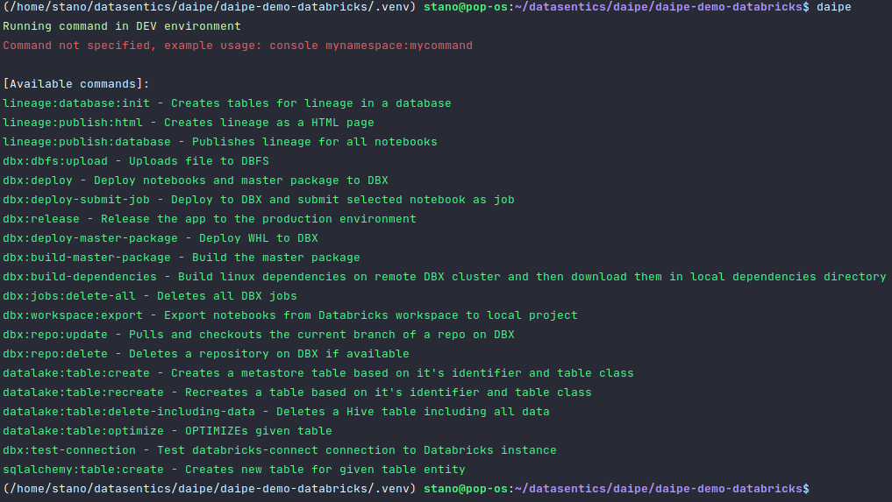

# Setup Daipe locally

!!! info "Prerequisites"
    The following software needs to be installed first:

      - [Miniconda package manager](https://docs.conda.io/en/latest/miniconda.html)
        - **IMPORTANT!** - To avoid Anaconda's [Terms of Service](https://www.anaconda.com/terms-of-service) run:
            - `conda config channels --remove defaults`
            - `conda config channels --append conda-forge`
        - This sets up a community-driven [conda-forge](https://conda-forge.org/) as the only conda repository.
      - [Git for Windows](https://git-scm.com/download/win) or standard Git in Linux (_apt-get install git_)
      
    We recommend using the following IDEs:
    
      - [PyCharm Community or Pro](https://www.jetbrains.com/pycharm/download/) with the [EnvFile plugin](https://plugins.jetbrains.com/plugin/7861-envfile) installed
      - [Visual Studio Code](https://code.visualstudio.com/download) with the [PYTHONPATH setter extension](https://marketplace.visualstudio.com/items?itemName=datasentics.pythonpath-setter) installed

    Tu run commands, use **Git Bash** on Windows or standard Terminal on **Linux/Mac**

1. Clone your Daipe project repo

2. Run `./env-init.sh` to initialize your local python virtual environment

3. Activating the Conda environment by running
   ```bash
   conda activate $PWD/.venv # or use the `ca` alias
   ```

4. Run the `daipe` command to list all available commands

