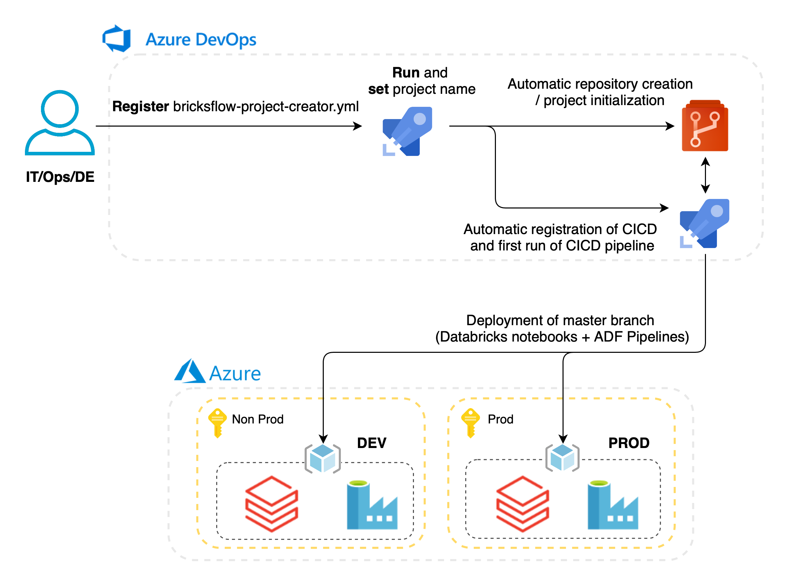

# Creating first Data Pipelines project

[Go to setup steps ↓](data-pipelines-project-setup.md#how-to-set-up-data-pipelines-project)

{: style="width: 700px; padding-left: 5%"}

## Introduction and Prerequisites

[`daipe-project-creator.yml`](https://github.com/DataSentics/adap-infra-template/blob/master/.cicd/pipelines/daipe-project-creator.yml) is Azure DevOps pipeline that initiates a new Data Pipelines project from the up-to-date [Daipe template](https://github.com/daipe-ai/databricks-skeleton).

The pipeline also contains the script for automatic protection of the master branch in newly created project.

**Data Pipelines project consists of the following components:**

- A git repo with DataFactory pipelines, Daipe project structure.

- CI/CD pipelines:
  
    - for testing/deployment of your Databricks notebooks / pipelines to the Databricks workspace based on the environment
    - for testing/deployment of DataFactory linked to your project

**Prerequisites**:

For initial setup of Data Pipelines project / repository:

- Successfully deployed DEV/TEST/PROD **Infrastructure** from [Datalake resources](datalake-resources-setup.md) page
- Permission to create Personal Access token in your DevOps organization project

## How to set up Data Pipelines project?

###1. Create Personal access token for the first run of the pipeline
- The Personal Access token is needed just for the first run of the pipeline to create a new Daipe based project DevOps repository and initial set up of the CICD pipeline
- **It can be deleted** after the successful run of the `daipe-project-creator.yml` 

**Go to**:

{: style="width: 300px; padding-left: 5%"}

Then create the new Personal Token with these permissions.

###2. Register the Daipe project creator pipeline and run it
**Create** a new DevOps pipeline based on `.cicd/pipelines/daipe-project-creator` located in infrastructure repo.

Set a **PA_TOKEN** variable under the Variables by providing Personal Access Token and **save** the pipeline. 

You can now rename the pipeline, if you'd like to.

**Run** the newly created pipeline:

- select the **dev** branch
- provide the **name of the project** you want to create.  

*selecting dev branch is necessary for initial setup of CICD in newly created Daipe project

Pipeline will need the permission to access the service principal for getting the Databricks workspace variables.

Open the run of the pipeline and under the **View** permit the usage of service principal. 

## Created resources 

After successful execution, you will find the following **resources**: 

- A new **git repo**
  
  {: style="width: 300px; padding-left: 5%"}

  
- **Protected master branch** 
  
    - the initial setup will create the master branch and deploy it to the DEV environment
    - for merging feature branch:
        - the Pull Request needs to be done
        - the notebooks will be deployed to the TEST environment for testing successful run of the pipelines
        - there needs to be in minimum ONE approval for the PR
        - Merging is done by the Squash commit

- **Main CI/CD pipeline** created for the repo. The pipeline is called `master-$yourprojectname-deployment`.
  
## Update project variables

**Set** SERVICE_CONNECTION_NAME variables for your newly created project in `.cicd/variables/variables.yml`.

**Commit** the changes:

- set the name of the branch, eq. `update-variables`
- check Create pull request

{: style="width: 500px; padding-left: 15%"}

It will automatically create Pull request to the master branch, get it approved and merge the changes.

The deployment pipeline will be executed automatically, after the merge of updated variables.  
You can find it running under the Pipelines tab.

The project will be deployed to the DEV Databricks and pipeline will ask for permission to the service connection, as it is shown on the picture below.

## Next steps 

After an initial run of the pipelines, you will have **codes** available in the **Databricks workspace** corresponding to the Databricks environment.

{: style="width: 350px; padding-left: 5%"}

You can find the links to the corresponding Databricks workspace directly in the CICD pipeline - Deploy Daipe section.
Note that if you enter the workspace for the first time, you have to launch it from the corresponding Azure resource page using Azure portal. 

Also the **DataFactory** in the specific environment **will be linked** to the codes in the Databricks workspace.

You can find the links to the corresponding DataFactory instance directly in the CICD pipeline - Deploy Data Factory section. 

For workflow details see [Developers workflow](data-pipelines-workflow.md) page.
