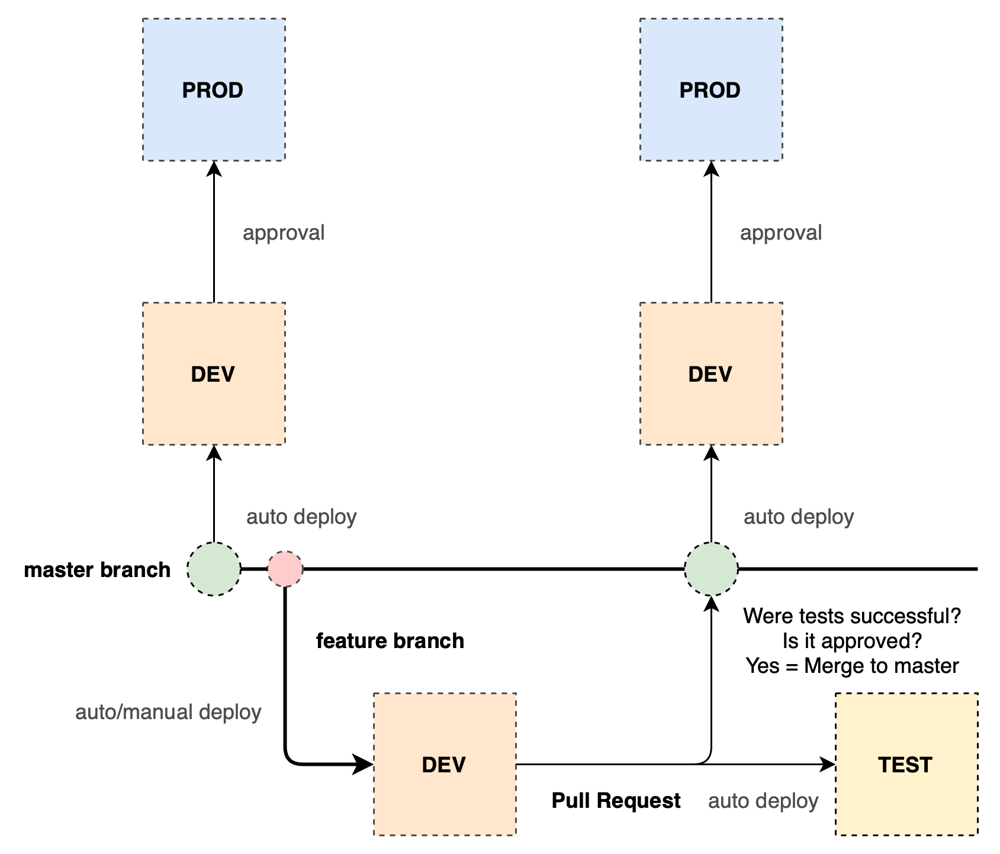

# Data pipelines development workflow

Our default workflow uses three environments: **DEV**, **TEST**, **PROD**.

{: style="width: 850px; padding-left: 5%"}

The feature branches can be merged to the master branch once Pull Request is approved:

- When the Pull Request is made, the feature branch is automatically deployed to the TEST environment and the tests are run
- As soon as the tests are completed successfully, the release manager can approve the Pull Request to merge the new branch to master
- Merging is done using the "squash" strategy (all changes are squashed into a single commit)

!!! tip "Environments customization"
    Use the `allowed_environments` config option in the [PROJECT_ROOT]/pyproject.toml file to set environments.
