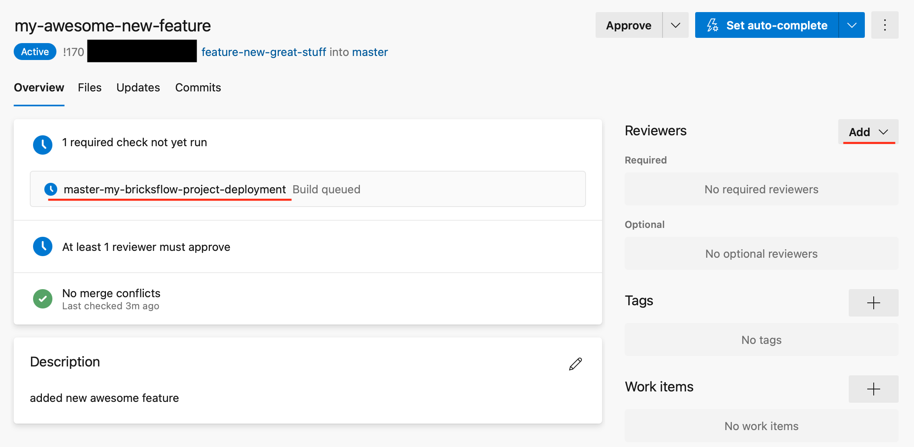

# Feature branch 

## Syncing local project with Databricks 

Create a feature branch and then with activated conda environment use the console command:

```bash
$ console dbx:deploy --env=dev
```

Your feature branch will be deployed to the DEV DataBricks workspace.


You can now code some awesome new features!

When you're happy with what you've done, open the project folder in terminal and use the console command:

```bash
$ console dbx:workspace:export --env=dev
```

Then you just need to commit the changes and push the feature branch to the DevOps project. 

## Developing DataFactory pipelines 


## Creating Pull Request

When you're done with all the changes create a Pull Request.


When the Pull Request is created the CICD pipeline is automatically triggered and the Databricks notebooks and associated DataFactory Pipelines are deployed to the TEST environment.

There will be newly created DataFactory instance based on the name of the feature branch, there you can run the tests or wait for the automatic schedule.

After the successful run of the tests add the Reviewer to the Pull Request.



When it's approved it could be merged by Squash commit to the master and the new awesome feature is automatically deployed to the DEV and with approval to the PROD environments.