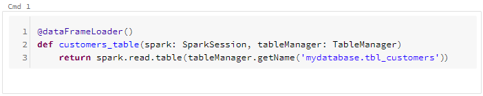
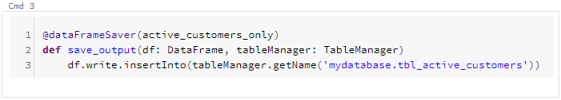

# Creating & Managing Datalake(house)

## 1. Introduction

Bricksflow greatly simplify datalake(house) management: 

* Tools to simplify & automate table creation, updates and migrations.
* Explicit table schema enforcing for Hive tables, CSVs, ...
* Decorators to write well-maintainable and self-documented function-based notebooks
* Rich configuration options to customize naming standards, paths, and basically anything to match your needs

## 2. Recommended notebooks structure

It is recommended to divide your tables and notebooks into the following layers:
 
* **bronze** - "staging layer", raw data from source systems
* **silver** - most business logic, one or multiple tables per use-case 
* **gold** - additional filtering/aggregations of silver data (using views or materialized tables) to be served to the final customers

For databases and tables in each of bronze/silver/gold layers it is recommended to follow the **[db_name/table_name]** directory structure.  

```yaml
src
    [PROJECT_NAME]
        bronze_db_batch
            tbl_customers
                tbl_customers.py # table creation code
                schema.py # output table schema definition
            tbl_products
                tbl_products.py
                schema.py
            tbl_contracts
                tbl_contracts.py
                schema.py
            ...
        silver_db_batch
            tbl_product_profitability
                tbl_product_profitability.py
                schema.py
            tbl_customer_profitability
                tbl_customer_profitability.py
                schema.py
            tbl_customer_onboarding
                tbl_customer_onboarding.py
                schema.py
            ...
        gold_db_batch
            vw_product_profitability # view on silver_db_batch.tbl_product_profitability
                vw_product_profitability.py
                schema.py
            tbl_customer_profitability # "materialized" view on silver_db_batch.tbl_customer_profitability
                tbl_customer_profitability.py
                schema.py
            vw_customer_onboarding
                vw_customer_onboarding.py
                schema.py
```

**Further notes:**

* Each table should have explicit schema defined (the *schema.py* file)
* Notebook python file (*tbl_product_profitability.py*) has the same name as the directory where it is stored (*tbl_product_profitability*)

## 3. Defining DataLake tables

To define the first tables, add the following configuration to your `config.yaml`:

```yaml
parameters:
  datalakebundle:
    tables:
      customer.my_table:
      product.another_table:
        partitionBy: ['date'] # optional table partitioning customization
```

### (required) Setting datalake storage path

Add the following configuration to `config.yaml` to set the default storage path for all the datalake tables:

```yaml
parameters:
  datalakebundle:
    defaults:
      targetPath: '/mybase/data/{dbIdentifier}/{tableIdentifier}.delta'
```

When setting `defaults`, you can utilize the following placeholders:

* `{identifier}` - `customer.my_table`
* `{dbIdentifier}` - `customer`
* `{tableIdentifier}` - `my_table`
* [parsed custom fields](#8-parsing-fields-from-table-identifier)

To modify storage path of any specific table, add the `targetPath` attribute to given table's configuration:

```yaml
parameters:
  datalakebundle:
    tables:
      customer.my_table:
        targetPath: '/some_custom_base/{dbIdentifier}/{tableIdentifier}.delta'
```

### Customizing table names

Table naming can be customized to match your company naming conventions. 

By default, all tables are prefixed with the environment name (dev/test/prod/...):

```yaml
parameters:
  datalakebundle:
    table:
      nameTemplate: '%kernel.environment%_{identifier}'
```

The `{identifier}` is resolved to the table identifier defined in the `datalakebundle.tables` configuration (see above).

By changing the `nameTemplate` option, you may add some prefix or suffix to both the database, or the table names:

```yaml
parameters:
  datalakebundle:
    table:
      nameTemplate: '%kernel.environment%_{dbIdentifier}.tableprefix_{tableIdentifier}_tablesufix'
```

## 4. Writing function-based notebooks

Compared to bare notebooks, the function-based approach brings the **following advantages**: 

1. create and publish auto-generated documentation and lineage of notebooks and pipelines (Bricksflow PRO) 
1. write much cleaner notebooks with properly named code blocks
1. (unit)test specific notebook functions with ease
1. use YAML to configure your notebooks for given environment (dev/test/prod/...)
1. utilize pre-configured objects to automate repetitive tasks

Function-based notebooks have been designed to provide the same user-experience as bare notebooks.
Just write the function, annotate it with `@[decorator]` (details bellow) and run the cell.

### Datalake-related decorators

Besides the standard `@notebookFunction` decorator, the [datalake-bundle](https://github.com/bricksflow/datalake-bundle) provides you with **3 new types of decorators**:
 
`@dataFrameLoader` - loads some Spark dataframe (from Hive table, csv, ...) and returns it

* Support for displaying results by setting the `display=True` decorator argument.



`@transformation` - transforms given dataframe(s) (filter, JOINing, grouping, ...) and returns the result

* Support for displaying results by setting the `display=True` decorator argument.
* Duplicate output columns checking enabled by default


`@dataFrameSaver` - saves given dataframe into some permanent storage (parquet, Delta, csv, ...)



### Chaining notebook-functions

Calls of the notebook functions can be chained by passing function names as decorator arguments:


Once you run the `active_customers_only` function's cell, it gets is automatically called with the dataframe loaded by the `customers_table` function.

Similarly, once you run the `save_output` function's cell, it gets automatically called with the filtered dataframe returned from the `active_customers_only` function.

## 5. Using table-specific configuration

Besides the [basic configuration options](https://github.com/bricksflow/databricks-bundle/blob/master/docs/configuration.md), you can also define **configuration for specific datalake tables**:

```yaml
parameters:
  datalakebundle:
    tables:
      customer.my_table:
        params:
          testDataPath: '/foo/bar'
```

Code of the **customer/my_table.py** notebook:

```python
from logging import Logger
from datalakebundle.notebook.decorators import notebookFunction, tableParams

@notebookFunction(tableParams('customer.my_table').testDataPath)
def customers_table(testDataPath: str, logger: Logger):
    logger.info(f'Test data path: {testDataPath}')
```

The `tableParams('customer.my_table')` function call is a shortcut to using `%datalakebundle.tables."customer.my_table".params%` string parameter.

## 6. Tables management

### Managing datalake tables using TableManager

`TableManager` defines set of commonly used methods to manage datalake tables.
The following example recreates the `my_crm.customers` table (delete old data, create new empty table) every time the notebook runs.

```python
from logging import Logger
from pyspark.sql.dataframe import DataFrame
from datalakebundle.notebook.decorators import dataFrameSaver
from datalakebundle.table.TableManager import TableManager

@dataFrameSaver()
def customers_table(df: DataFrame, logger: Logger, tableManager: TableManager):
    logger.info('Recreating table my_crm.customers')

    tableManager.recreate('my_crm.customers')

    return df.insertInto(tableManager.getName('my_crm.customers'))
```

**All TableManager's methods**:

* `getName('my_crm.customers')` - returns final table name
* `getConfig('my_crm.customers')` - returns [TableConfig instance](https://github.com/bricksflow/datalake-bundle/blob/master/src/datalakebundle/table/config/TableConfig.py)
* `create('my_crm.customers')` - creates table
* `createIfNotExists('my_crm.customers')` - creates table only if not exist yet
* `recreate('my_crm.customers')` - recreates (deletes Hive table, **deletes data**, create new empty table)
* `exists('my_crm.customers')` - checks if table exists
* `delete('my_crm.customers')` - deletes Hive table, **deletes data**
* `optimizeAll()` - runs `OPTIMIZE` command on all defined tables

## 7. Managing datalake tables using the console commands

**Example**: To create the `customer.my_table` table in your datalake, just type `console datalake:table:create customer.my_table --env=dev`
into your terminal within your activated project's virtual environment.
The command connects to your cluster via [Databricks Connect](https://github.com/bricksflow/databricks-bundle/blob/master/docs/databricks-connect.md) and creates the table as configured.

Datalake management commands: 

* `datalake:table:create [table identifier]` - Creates a metastore table based on it's YAML definition (name, schema, data path, ...)

* `datalake:table:recreate [table identifier]` - Re-creates a metastore table based on it's YAML definition (name, schema, data path, ...)

* `datalake:table:delete [table identifier]` - Deletes a metastore table including data on HDFS

* `datalake:table:create-missing` - Creates newly defined tables that do not exist in the metastore yet

* `datalake:table:optimize-all` - Runs the OPTIMIZE command on all defined tables (Delta only)

## 8. Parsing fields from table identifier

Sometimes your table names may contain additional flags to explicitly emphasize some meta-information about the data stored in that particular table.

Imagine that you have the following tables:

* `customer_e.my_table`
* `product_p.another_table`

The `e/p` suffixes describe the fact that the table contains *encrypted* or *plain* data. What if we need to use that information in our code?

You may always define the attribute **explictly** in the tables configuration: 

```yaml
parameters:
  datalakebundle:
    table:
      nameTemplate: '{identifier}'
    tables:
      customer_e.my_table:
        encrypted: True
      product_p.another_table:
        encrypted: False
```

If you don't want to duplicate the configuration, try using the `defaults` config option to parse the *encrypted/plain* flag into the new `encrypted` boolean table attribute: 

```yaml
parameters:
  datalakebundle:
    table:
      nameTemplate: '{identifier}'
      defaults:
        encrypted: !expr 'dbIdentifier[-1:] == "e"'
    tables:
      customer_e.my_table:
      product_p.another_table:
```

For more complex cases, you may also use a custom resolver to create a new table attribute:

```python
from box import Box
from datalakebundle.table.identifier.ValueResolverInterface import ValueResolverInterface

class TargetPathResolver(ValueResolverInterface):

    def __init__(self, basePath: str):
        self.__basePath = basePath

    def resolve(self, rawTableConfig: Box):
        encryptedString = 'encrypted' if rawTableConfig.encrypted is True else 'plain'

        return self.__basePath + '/' + rawTableConfig.dbIdentifier + '/' + encryptedString + '/' + rawTableConfig.tableIdentifier + '.delta'
```

```yaml
parameters:
  datalakebundle:
    table:
      nameTemplate: '{identifier}'
      defaults:
        targetPath:
          resolverClass: 'datalakebundle.test.TargetPathResolver'
          resolverArguments:
            - '%datalake.basePath%'
    tables:
      customer_e.my_table:
      product_p.another_table:
```
