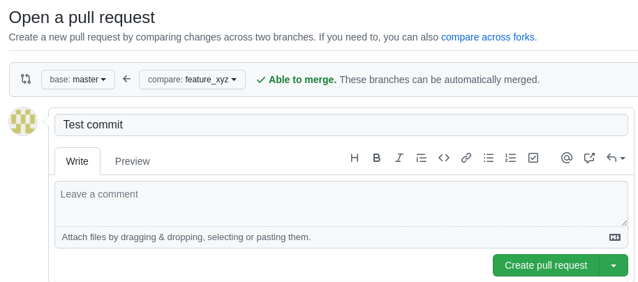

# Git workflow in Databricks

1. Log into your Databricks Workspace
    - If you're opening the project for the first time - Under Repos open your personal folder and press "Add Repo":
    
      - Enter your project HTTPS Clone Url and confirm:

2. Open the Git menu (branch name next to the repo name, or right click) and checkout a new feature branch:

3. After making changes to your feature branch you can commit the changes back in the Git menu:

4. After you are done with the changes, open a Pull Request into your main branch back in your repository on GitHub:

