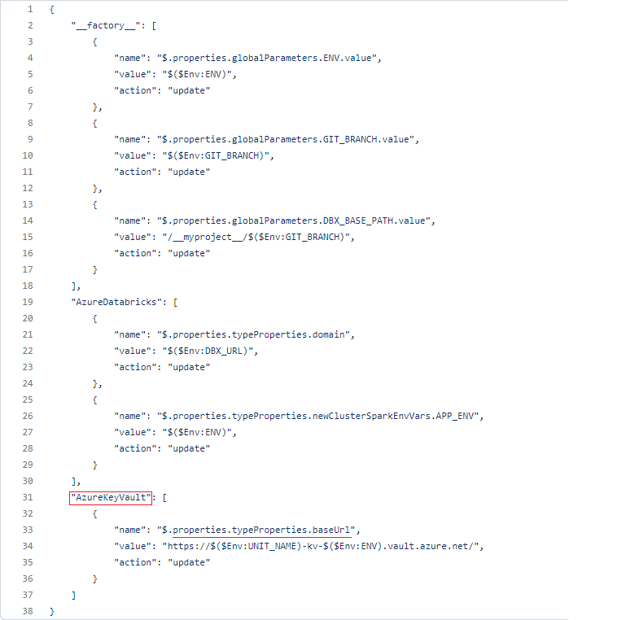
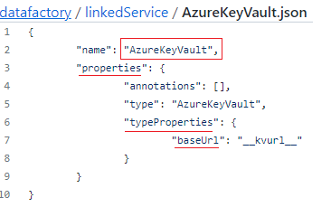

# Data Factory parametrization

If you want to override parameters for specific environment you can do this in 
`datafactory/deployment/config-{env}.json`

For example if you want to override parameters of AzureKeyVault linked service.
You must specify exact name of the linked service, in name specify json path
of the property you want to override, and the value the property should have.

