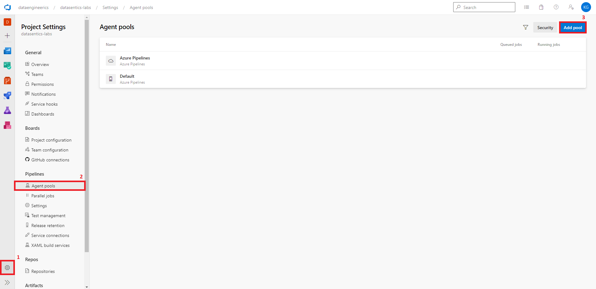
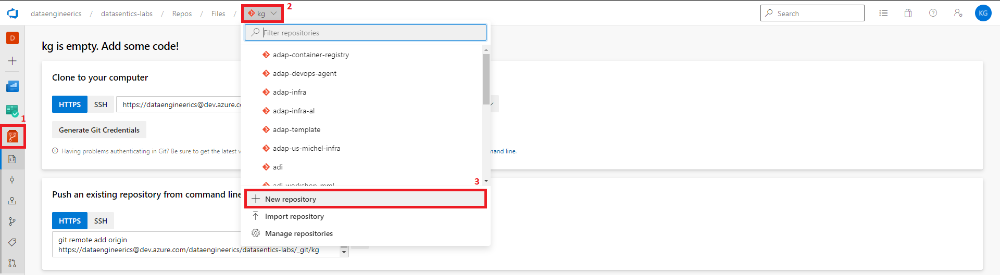
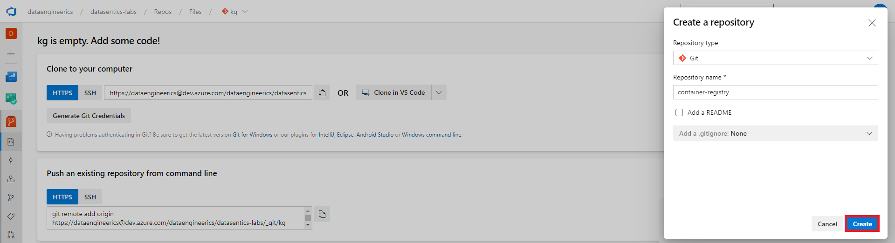
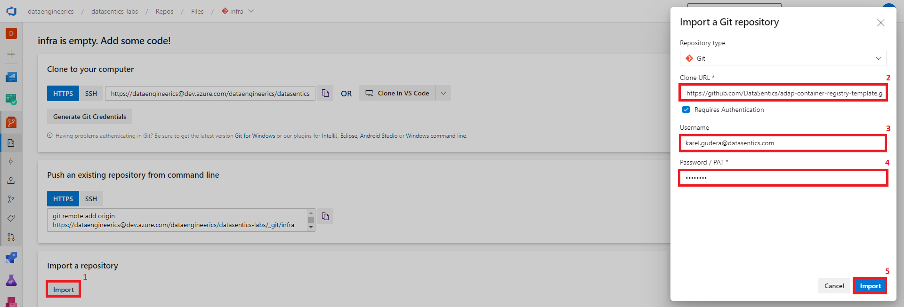
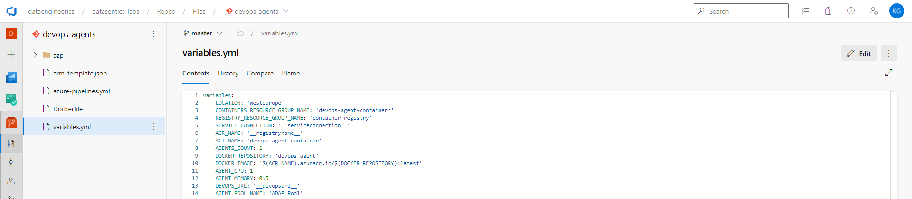
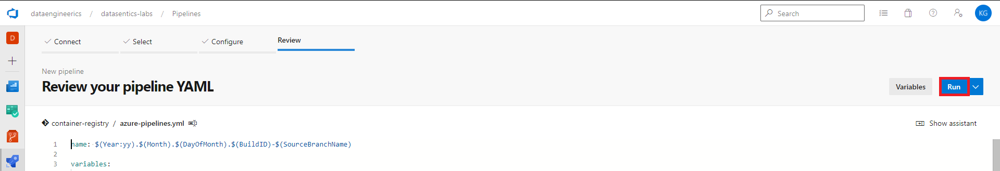
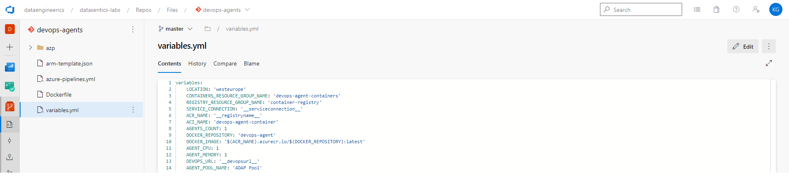
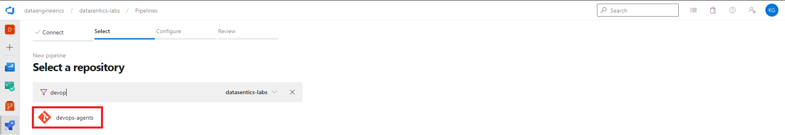
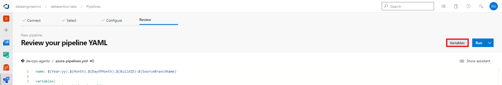
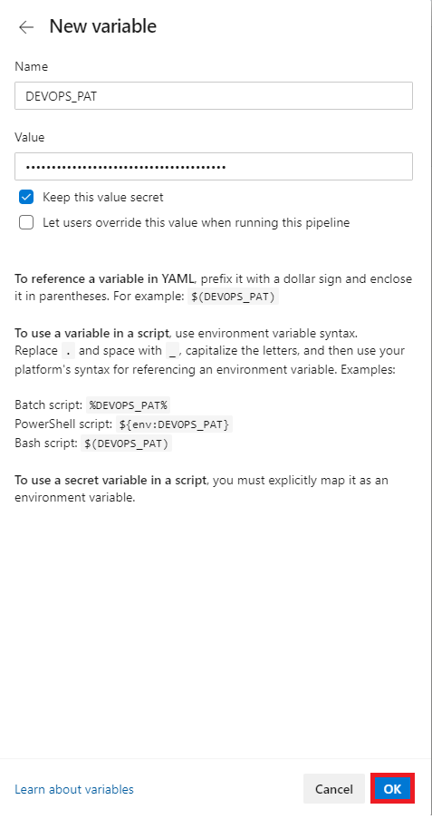

# Setting up Azure DevOps agents (optional)

You need some compute where your CI/CD pipelines are run. You can use Microsoft hosted agents or if you want more control over your CI/CD runtime you can setup self-hosted agents.

## 1. Create Azure DevOps Agent Pool

First you need to create Agent Pool in Azure DevOps.

- Go to your project in [Azure DevOps](https://dev.azure.com)
- Click on Settings
- Click on Agent pools
- Click on Add pool



- Select Self-hosted Pool type
- Fill `ADAP Pool` in name
- Uncheck Grant access permission to all pipelines
- Click Create


## 2. Create Personal Access Token (PAT)

Now we need to create Personal Access Token that will have access to this pool.

- Click on User setting in upper right corner and then on Personal access tokens


- Click on New Token


- In right menu click on Show all scopes
- Select Agent Pools Read & Manage
- In Name fill AZP_TOKEN
- Click Create
- Copy and store the token for later use


## 3. Create Container Registry

We need registry to store our docker image for agents.

- In Azure DevOps click on repositories
- Click on dropdown menu
- Click on New repository



- Name it e.g. `container-registry`
- Uncheck Add a README
- Click Create



- Click on Import
- In Clone URL fill `https://github.com/DataSentics/adap-container-registry-template.git`
- In Username fill your Datasentics email
- In Password fill your Github password / token
- Click on Import



- After import is done open file `variables.yml`


- Replace placeholders
- SERVICE_CONNECTION - your `dev` service connection, e.g. `devops-service-connection-to-devsubscription`
- ACR_NAME - name of the registry, e.g. `mydevopsregistry`

**Caution**  
<span style="color: red">Registry name must be globally unique and may contain only lower case letters up to 23 characters.</span>

- Create pipeline to deploy your registry
- In Azure DevOps click on pipelines
- Click on New pipeline


- Select Azure Repos Git



- Select `container-registry` repository


- Click Run



This pipeline will deploy container registry resource.

## 4. Create Agents

Now we need to deploy the agents it self.

- Repeat steps from previous section to create new repository but this time name the repository e.g. `devops-agents` and import code from `https://github.com/DataSentics/adap-devops-agents-template.git`
- After import is done open file `variables.yml` and replace placeholders
- SERVICE_CONNECTION - your `dev` service connection, e.g. `devops-service-connection-to-devsubscription`
- ACR_NAME - name of your previously created registry (`mydevopsregistry`)
- DEVOPS_URL - url of your devops organization, e.g. `https://dev.azure.com/organization/`
- You can also set how much agents you want (AGENTS_COUNT) and how much cpu and memory in GB should each agent have (AGENT_CPU, AGENT_MEMORY)



- Repeat steps from previous section to create pipeline but this time select `devops-agents` repository



- Click on Variables



- Click on New variable


- In Name fill `DEVOPS_PAT`
- In Value fill token from section 2
- Check Keep this value secret
- Click OK



- Click Save


- Click Run


- After few minutes when the pipeline finishes you should be able to see agent (or agents) registered in ADAP Pool


## 5. Let pipelines know to use this Agent Pool

So far we only created Agent Pool and registered agent(s) in that pool. But in order to run jobs/tasks on that pool we must inform our pipelines to use that pool.

- Our pipelines are defined in repository as a yaml code 
- Lets take look at `infra` repo created in section [Data Lake resources](datalake-resources-setup.md)
- Open file `azure-pipelines.yml` and you should see following code


- You can see following code at lines 17 and 18

```yml
pool:
  vmImage: 'ubuntu-20.04'
```

- This needs to be replaced for 

```yml
pool: 'ADAP Pool'
```

- You also need to make same replacement in file `.cicd/templates/release-jobs.yml`
- When You commit the changes next time you run infra pipeline it will run on self-hosted agent registered in `ADAP Pool`
