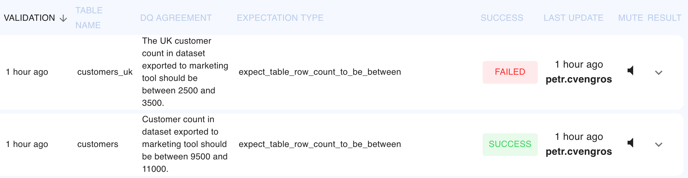

# Viewing Validation Results

{: style="width: 800px; padding-left: 5%"}

The *Data User* can see their DQ Agreements in the web app deployed in your infrastructure. They can view the last run of each expectation and see the result details. 