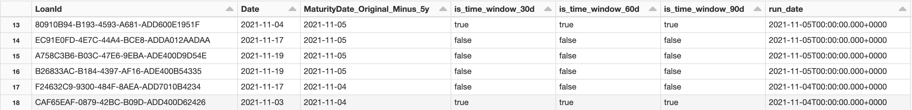
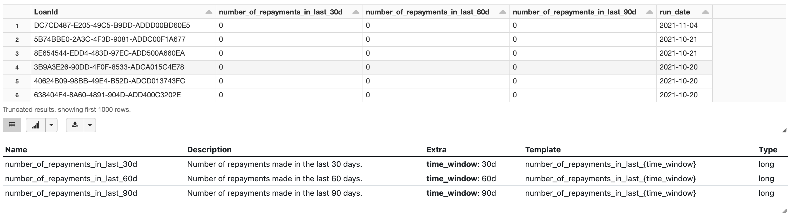

# Developing features with time windows

Before reading this article, it is recommended to get familiar with [using time windows](time-windows.md).

---

If you need to create __the same feature__ for a __fixed__ as well as __dynamic__ `run_date`, here is the recommended approach.

Dynamic run date is used when the feature is calculated in reference to a different date for each instance of an entity, e. g. a `client`.
A canonical example of a feature like this is _"How many times had a client paid by a debit card {time_windows} days before_ __some date"__

This feature can exist in __two states__:

- __hot__: feature is calculated __periodically__ (e.g. every day) and it means _"How many times had a client paid by a debit card {time_windows} days before_ __the last calculation"__
- __frozen__: feature is calculated __once__ and it means _"How many times had a client paid by a debit card {time_windows} days before they_ __took a mortgage"__

The following method enables you to calculate both of these features using the same code.

### Setup

First, variables to control the flow of operations have to be created. 

A good practice is to define these using [Widgets](../using-widgets.md) but here they are just global variables for simplicity.

`target_date_column_name` is the most important variable for this use case. Its value is either `run_date` –– signaling usage of a __static__ date, or a name of an existing column
in this case `MaturityDate_Original_Minus_5y` -- signaling the usage of a __dynamic__ date. 

```python
from featurestorebundle.windows.windowed_features import windowed, with_time_windows


run_date = dt.date.today().strftime("%Y-%m-%d")
time_windows = ["30d", "60d", "90d"]
target_date_column_name = "MaturityDate_Original_Minus_5y"  # or "run_date"
target_date_column = f.to_timestamp(f.lit(run_date)) if target_date_column_name == "run_date" else f.to_timestamp(f.col(args.target_date_column_name))
```

### Add is_time_window columns based on target_date_column

The input DataFrame is passed into the `with_time_windows` function which generates one boolean column `is_time_window_{time_window}` for each `time_window` which indicates whether or not the row in desired time window.
The __time_windows__ are created in relation to the `target_date_column` 

```python
@transformation(joined_loans_and_repayments, target_date_column, args, display=True)
def joined_loans_and_repayments_with_time_windows(df: DataFrame, target_date_column: Column):
    df_with_time_windows = with_time_windows(df, "Date", target_date_column, time_windows)
    
    return (
      df_with_time_windows.withColumn("run_date", target_date_column)
    )
```



### Aggregate features the exact same way

The feature code does not need to change whatsoever. Instead of appending the static `run_date` the `target_date_column` is used as `run_date`.

```python
@transformation(joined_loans_and_repayments_with_time_windows, args, display=True)
@loan_feature(
  ('number_of_repayments_in_last_{time_window}', 'Number of repayments made in the last {time_window}.'),
    category = 'test',
)
def repayments_before_date(df: DataFrame, args: Args):
  columns_for_agg = []
  for time_window in args.time_windows:
      columns_for_agg.extend([
        f.sum(
          windowed(f.lit(1), time_window)
        ).alias(f"number_of_repayments_in_last_" + f"{time_window}",),
      ])
  
  grouped_df = (
    df.groupby(["LoanId"])
           .agg(
             *columns_for_agg,
             f.first(args.target_date_column).alias("run_date"),
           )
  )
  
  return (
    grouped_df
  )
```


