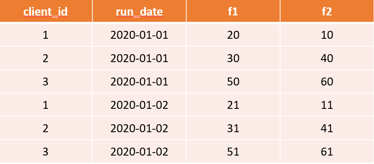

# Features Tracking

Feature store can track what features were computed and when.

Let's suppose that we have the following Feature Store.

And we want to add following dataframe which contains new feature `f3`.

The Feature Store can keep track that feature `f3` was not computed for
previous dates.

You can think of that `RED NULLS` as uncomputed values.
