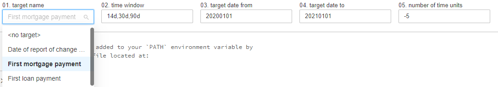

# Target Store

Feature store has an interface for reading from Target Store.

Target Store is a simple table of e.g. `clients, dates and targets`. For
example target may be `First mortgage payment`. So we have set of
clients and dates of their first mortgage payment.

Unfortunately Feature Store not yet provides an interface for writing to
Target Store, so it has to be done "with bare hands".

Paths to target store tables are specified in config.

```yaml
parameters:
  featurestorebundle:
    target:
      entity_targets_table_name_template: 'targets_{entity}'
      entity_targets_path_template: '%featurestorebundle.base_path%/targets/{entity}.delta'
      targets_table: 'targets'
      targets_path: '%featurestorebundle.base_path%/targets/targets.delta'
      backend: delta_path # available: delta_table, delta_path
```

So you basically need two tables.

- One table holds targets for given entity e.g. `client`

| client_id  | timestamp  |       target_id        |
|:----------:|:----------:|:----------------------:|
|     1      | 2019-01-05 | first_mortgage_payment |
|     2      | 2018-06-14 | first_mortgage_payment |
|     3      | 2017-08-24 |   first_loan_payment   |

- Second table is basically enum of targets

|       target_id        |           description           |
|:----------------------:|:-------------------------------:|
| first_mortgage_payment | Client's first mortgage payment |
|   first_loan_payment   |   Client's first loan payment   |

You need to put those tables in appropriate location given by the
configuration.

If target store is set you can now compute features for given targets.

First use `WidgetsFactory` class to init widgets.

```python
import daipe as dp

@dp.notebook_function()
def init_widgets(widgets_factory: dp.fs.WidgetsFactory):
    widgets_factory.create()
```

You can now select target you want.



And finally when loading input dataframe you need to use function
`add_timestamps` which will make sure you will be working only with
clients given by selected target.

```python
@dp.transformation(
    dp.fs.add_timestamps(
        dp.read_table('silver.card_transactions'),
        entity,
    ),
)
def card_transactions(card_transactions_with_targets: DataFrame):
    return card_transactions_with_targets
```
