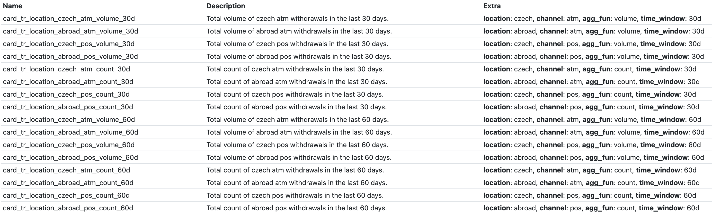

# Using templates for metadata extraction

To get metadata from features, it is necessary to use __templates__ instead of exact feature names.

A __template__ is a feature name containing a section in curly braces e. g. `feature_example_{time_window}`.
The part of the actual column name is then _matched_ by the `time_window` placeholder e. .g if `column_name` is `feature_example_90d`
then `time_window` metadata will be `90d`.

The matched metadata is saved into the __Extra__ `key` `value` column of the metadata table and is also propagated into the description using a description template.

!!! warning "Template rules"
    
    - Placeholders will match any string which __DOES NOT__ inlude `_`.
    - One template __CAN__ match multiple columns.
    - All columns __MUST__ be matched by __EXACLY ONE__ template.
    - All templates __MUST__ match __AT LEAST__ one column.
    - `"{feature_name}"` __IS__ a valid template and it __WILL__ match __EVERY__ column which doesn't include `_` and its __ONLY__ piece of metadata will be `feature_name`.
    - `"there_is_no_template_here"` __IS__ also a valid template and it __WILL__ match __ONLY__ a column with that exact name and it will __NOT__ have any metadata.
    
    
    - Templates matching priority is from top to bottom –> always put more specific templates on top and more general template on the bottom. 


## Imports

```python
import daipe as dp
from featurestorebundle.time_windows import time_windows as tw
```

## Features calculation

```python
@dp.transformation(card_transactions)
@client_feature(
   # Feature template
  ("card_tr_location_{location}_{channel}_{agg_fun}_{time_window}",
   # Description template
   'Total {agg_fun} of {location} {channel} withdrawals in the last {time_window}.'),
  category = 'card_transaction_country_channel'
)
def card_channle_country_features(wdf: WindowedDataFrame):
    def country_agg_features(_) -> List[tw.WindowedColumn]:
        return [
            tw.sum_windowed(
                f.col("cardtr_country").isin("CZ", "CZE").cast("integer"),
                "card_tr_location_czech_count_{time_window}",
            ),
            tw.sum_windowed(
                (~f.col("cardtr_country").isin("CZ", "CZE")).cast("integer"),
                "card_tr_location_abroad_count_{time_window}",
            ),
            tw.sum_windowed(
                f.when(
                    f.col("cardtr_country").isin("CZ", "CZE"),
                    f.col("cardtr_amount_czk"),
                ).otherwise(0),
                "card_tr_location_czech_volume_{time_window}",
            ),
            tw.sum_windowed(
                f.when(
                    ~f.col("cardtr_country").isin("CZ", "CZE"),
                    f.col("cardtr_amount_czk"),
                ).otherwise(0),
                "card_tr_location_abroad_volume_{time_window}",
            ),
        ]

    def flag_features(time_window: str) -> List[Column]:
        return [
            tw.column_windowed(
                (f.col(f"card_tr_location_abroad_count_{time_window}") > 0).cast(
                    "integer"
                ),
                f"card_tr_location_abroad_flag_{time_window}",
            )
        ]
  
    return wdf.time_windowed(country_agg_features, flag_features)
```

### Matched metadata

All matched placeholders are shown in the __Extra__ column as `key` `value` pairs.

__Notice__ that the descriptions correspond with the metadata.


