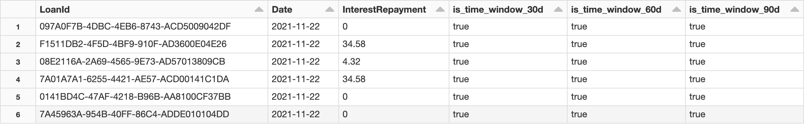

# Time windows helper functions 

## with_time_windows() {#with_time_windows}
__with_time_windows()__(`df: DataFrame, window_col: str, target_date_column: Column, time_windows: List`) -> `DataFrame`

> Used for adding time window columns to a DataFrame.

- `df` : DataFrame, input DataFrame
- `window_col` : str, name of `Date` or `Timestamp` Column in `df`, which is substracted __from__ the `target_date_column` to create the time window interval
- `target_date_column` : Column, date from which the time window is substracted
- `time_windows`: List[str], list of time windows as a `[0-9]+[dhw]`, suffixes `d` = days, `h` = hours, `w` = weeks 

Example:

```python
@transformation(read_table("silver.tbl_joined_loans_and_repayments"), display=True)
def joined_loans_and_repayments_with_time_windows(df: DataFrame):
    return (
      with_time_windows(df, "Date", f.lit(run_date), time_windows)
      .select("LoanId", "Date", "InterestRepayment", *[f"is_time_window_{time_window}" for time_window in args.time_windows])
    )
```



---

## windowed() {#windowed}
__windowed()__(`column: Column, time_window: str, default_value: Any = 0`) -> `Column`

> Wrapper for the following expression

```python
f.when(f.col(f"is_time_window{time_window}"), column).otherwise(f.lit(default_value))
```

- `column` : Column, Column to be aggregated per multiple time_windows
- `time_window` : str, time window string
- `default_value` : Any = 0, default value of `column` when `is_time_window_{time_window}` is `False`

Example:

```python
agg_cols.extend([
        f.sum(
          windowed(f.col("InterestRepayment"), time_window)
        ).alias(f'interest_repayment_sum_{time_window}')
      ])
```
---

