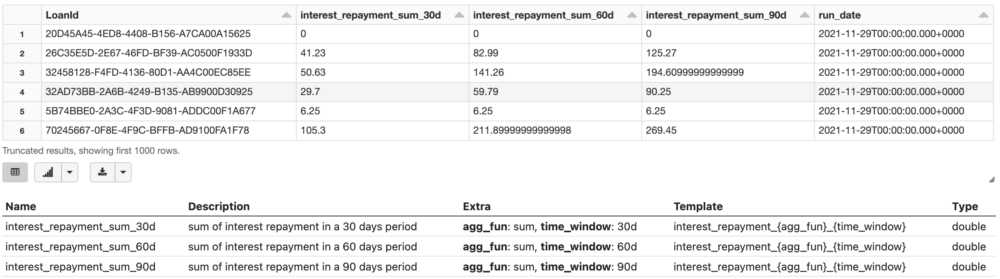
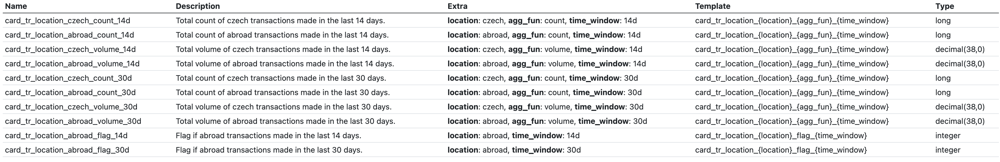

# Developing features with time windows

Before reading this article, it is recommended to get familiar with [using templates](templates.md).

---

If you need to create the same feature just for a multiple time windows e. g. __Number of repayments made in the last 30, 60 and 90 days__, there is an optimal way to do it.

## Setup

First, helper functions for dealing with time windows need to be imported and variables `run_date` and `time_windows` need to be defined.

For more information about these functions, see the [technical reference](time-windows-technical-reference.md).

A good practice is to define these using [Widgets](../using-widgets.md).

```python
import daipe as dp
import featurestorebundle.time_windows as tw
from featurestorebundle.time_windows.time_windows import WindowedColumn, WindowedDataFrame


@dp.notebook_function()
def widgets(widgets: dp.Widgets):
    widgets.add_text('time_windows', "14d,30d,90d", default_value="14d,30d,90d")
```

### Add time window columns

First the input DataFrame containing `client_id` and `run_date` is loaded.

```python
@dp.transformation(
    dp.read_delta("%datalakebundle.card_transactions.source_path%"),
    display=False,
)
def card_transactions(card_transactions: DataFrame):
    return card_transactions
```

The input DataFrame is passed into the `make_windowed` decorator function which returns `WindowedDataFrame` instance.

`WindowedDataFrame` inherits from a `DataFrame` which means it is possible to use all methods and properties as it was a regular `DataFrame`.

It has some added properties such as `entity` and `time_windows` which allow it to handle calculations of windowed columns. More about `WindowedDataFrame` in the [technical reference](time-windows-technical-reference.md).

```python
@dp.transformation(
    make_windowed(
        card_transactions,
        client_entity,
        "cardtr_process_date",
    ),
    display=False,
)
def card_transactions_with_time_windows(wdf: WindowedDataFrame):
    return wdf
```

## Writing time windowed features

There are generally two options how to write time windowed features - a declarative and a customizable style.

The declarative style is the recommended and should be used in a __95 %__ of cases.

The customizable style should only be used when there is absolutely no way to achieve the same functionality using the declarative style.

### Option 1: Declarative style

Generally, each feature cell consists of aggregating some columns and potentially adding some more non aggregated ones afterwards.

Therefore the declarative style has 3 steps:
1. Define a function which takes time_window as argument and returns a list of __aggregated Columns__
1. Define a function which takes time_window as argument and returns a list of __NON aggregated Columns__
1. Use an instance of `time_windowed` method of the `WindowedDataFrame` instance which handles the proper grouping by `[id_column, time_column]` and time windowed columns

```python
@dp.transformation(card_transactions, display=False)
@client_feature(
  ('card_tr_location_{location}_flag_{time_window}', 'Flag if {location} transactions made in the last {time_window}.'),
  ('card_tr_location_{location}_{agg_fun}_{time_window}', 'Total {agg_fun} of {location} transactions made in the last {time_window}.',),
  category = 'card_transaction_city',
)
def card_country_features(wdf: WindowedDataFrame):
    # 1. Define a function which takes time_window as argument and returns a list of aggregated Columns
    def country_agg_features(time_window: str) -> List[WindowedColumn]:
        return [
            tw.sum_windowed(
                f.col("cardtr_country").isin("CZ", "CZE").cast("integer"),
                f"card_tr_location_czech_count_{time_window}",
            ),
            tw.sum_windowed(
                (~f.col("cardtr_country").isin("CZ", "CZE")).cast("integer"),
                f"card_tr_location_abroad_count_{time_window}",
            ),
            tw.sum_windowed(
                f.when(
                    f.col("cardtr_country").isin("CZ", "CZE"),
                    f.col("cardtr_amount_czk"),
                ).otherwise(0),
                f"card_tr_location_czech_volume_{time_window}",
            ),
            tw.sum_windowed(
                f.when(
                    ~f.col("cardtr_country").isin("CZ", "CZE"),
                    f.col("cardtr_amount_czk"),
                ).otherwise(0),
                f"card_tr_location_abroad_volume_{time_window}",
            ),
        ]

    # 2. Define a function which takes time_window as argument and returns a list of NON aggregated Columns
    def flag_features(time_window: str) -> List[Column]:
        return [
            tw.column_windowed(
                (f.col(f"card_tr_location_abroad_count_{time_window}") > 0).cast(
                    "integer"
                ),
                f"card_tr_location_abroad_flag_{time_window}",
            )
        ]
  
    # 3. Return WindowedDataFrame instance which handles the proper grouping by [id_column, time_column] and time windowed columns
    return wdf.time_windowed(country_agg_features, flag_features)
```




### Option 2: Customizable style

For some complicated features it might be necessary to use the customizable style.
Methods like `get_windowed_column_list` and `apply_per_time_window` are provided to simplify some frequently used tasks.

If it's necessary to add more non-time-windowed columns into the aggregation, it is possible to get the list using the `get_windowed_column_list` methods and customize it.

For any other operations there is always the `apply_per_time_window` method which takes as argument a function of two arguments (DataFrame and time_window)
and returns a modified DataFrame.

```python
@dp.transformation(df_ct_amount, display=False)
@client_feature(
    (
        "card_tr_location_cz_city_count_{time_window}",
        "Number of different Czech cities where transaction was made in last {time_window} days.",
    ),
    (
        "card_tr_location_city_most_common_{agg_fun}_pctg_{time_window}",
        "Percentage of {agg_fun} spent in the most common city in last {time_window} days.",
    ),
    (
        "card_tr_location_city_most_common_{agg_fun}_{time_window}",
        "Total {agg_fun} spent in the most common city in last {time_window}.",
    ),
    (
        "card_tr_location_city_most_common_{time_window}",
        "The city where largest volume of money was spent in last {time_window}.",
    ),
    category="card_transaction_city",
)
def card_city_features(wdf_ct_amount: WindowedDataFrame):
    # Define a function which takes WindowedDataFrame and time_window and returns WindowedDataFrame
    def pctg_features(df: WindowedDataFrame, time_window: str) -> WindowedDataFrame:
        return df.withColumn(
            f"card_tr_location_city_most_common_volume_pctg_{time_window}",
            f.round(
                f.col(f"card_tr_location_city_most_common_volume_{time_window}")
                / f.col(f"card_tr_location_volume_{time_window}"),
                2,
            ),
        ).withColumn(
            f"card_tr_location_city_most_common_count_pctg_{time_window}",
            f.round(
                f.col(f"card_tr_location_city_most_common_count_{time_window}")
                / f.col(f"card_tr_location_count_{time_window}"),
                2,
            ),
        )

    # Get windowed column names
    cols_to_drop = wdf_ct_amount.get_windowed_column_list(
        [
            "card_tr_location_volume_{time_window}",
            "card_tr_location_count_{time_window}",
        ]
    )
    
    # Use apply_per_time_window to apply the defined function
    return wdf_ct_amount.apply_per_time_window(pctg_features).drop(*cols_to_drop)
```
