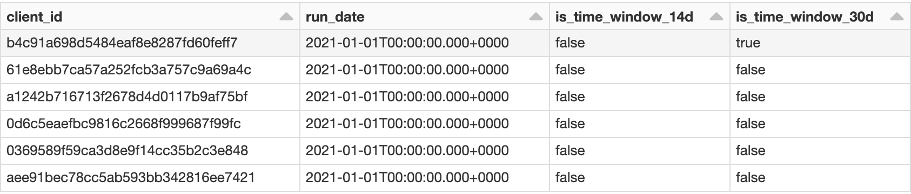
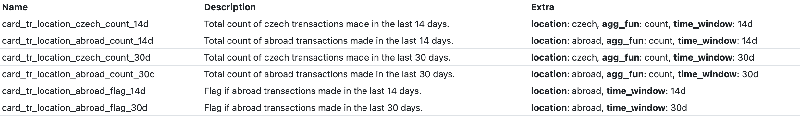

# Developing features with time windows

Before reading this article, it is recommended to get familiar with [using templates](templates.md).

---

If you need to create the same feature just for a multiple time windows e. g. __Number of repayments made in the last 30, 60 and 90 days__, there is an optimal way to do it.

## Setup

First, helper functions for dealing with time windows need to be imported and variables `run_date` and `time_windows` need to be defined.

For more information about these functions, see the [technical reference](time-windows-technical-reference.md).

A good practice is to define these using [Widgets](../using-widgets.md).

```python
from featurestorebundle.windows.windowed_features import windowed, with_time_windows, apply_per_window, get_windowed_column_list, TimeWindowed


@notebook_function()
def widgets(widgets: Widgets):
    widgets.add_multiselect('time_windows', ["14d", "30d", "90d"], default_values=["14d"])
```

### Add time window columns

The input DataFrame is passed into the `with_time_windows` function which generates one boolean column `is_time_window_{time_window}` for each `time_window` which indicates whether or not the row in desired time window.

```python
@transformation(
    read_delta('%source_path.from.config%'),
    get_widget_value("time_windows"),
    display=False,
)
def card_transactions(card_transactions: DataFrame, time_windows: List[str]):
    return (
      with_time_windows(card_transactions,      # Input DataFrame
                        "cardtr_process_date",  # Column name of the event date is subsctracted from "run_date"
                        f.col("run_date"),      # Column object which the "cardtr_process_date" is being substracted from
                        time_windows)
    )
```



## Writing time windowed features

There are generally two options how to write time windowed features - a declarative and a customizable style.

The declarative style is the recommended and should be used in a __95 %__ of cases.

The customizable style should only be used when there is absolutely no way to achieve the same functionality using the declarative style.

### Option 1: Declarative style

Generally, each feature cell consists of aggregating some columns and potentially adding some more non aggregated ones afterwards.

Therefore the declarative style has 3 steps:
1. Define a function which takes time_window as argument and returns a list of __aggregated Columns__
1. Define a function which takes time_window as argument and returns a list of __NON aggregated Columns__
1. Return an instance of `TimeWindowed` instance which handles the proper grouping by `[id_column, time_column]` and time windowed columns

```python
@transformation(card_transactions, display=False)
@client_feature_writer(
  ('card_tr_location_{location}_flag_{time_window}', 'Flag if {location} transactions made in the last {time_window}.'),
  ('card_tr_location_{location}_{agg_fun}_{time_window}', 'Total {agg_fun} of {location} transactions made in the last {time_window}.',),
  category = 'card_transaction_city',
)
def card_country_features(card_transactions: DataFrame):
    # 1. Define a function which takes time_window as argument and returns a list of aggregated Columns
    def country_agg_features(time_window: str) -> List[Column]:
        return [
            f.sum(
              windowed(f.col("cardtr_country").isin('CZ', 'CZE').cast("integer"), time_window)
            ).alias(f'card_tr_location_czech_count_{time_window}'),
            f.sum(
              windowed((~f.col("cardtr_country").isin('CZ', 'CZE')).cast("integer"), time_window)
            ).alias(f'card_tr_location_abroad_count_{time_window}'),
        ]
    
    # 2. Define a function which takes time_window as argument and returns a list of NON aggregated Columns
    def flag_features(time_window: str) -> List[Column]:
        return [(f.col(f"card_tr_location_abroad_count_{time_window}") > 0).cast("integer").alias(f"card_tr_location_abroad_flag_{time_window}"),]
    
    # 3. Return an instance of TimeWindowed instance which handles the proper grouping by [id_column, time_column] and time windowed columns
    return (
        TimeWindowed(card_transactions,
                     country_agg_features, # Aggregated columns function
                     flag_features)        # Non aggregated columns function
    )
```




### Option 2: Customizable style

For some complicated features it might be necessary to use the customizable style.
Functions like `get_windowed_column_list` and `apply_per_window` are provided to simplify some frequently used tasks.

If it's necessary to add more non-time-windowed columns into the aggregation, it is possible to get the list using `get_windowed_column_list` and customize it.

For any other operations there is always the `apply_per_window` function which takes as argument a function of two arguments (DataFrame and time_window)
and returns a modified DataFrame.

```python
@transformation(card_transactions, get_widget_value("time_windows"), display=False)
@client_feature_writer(
  ('card_tr_location_{location}_flag_{time_window}', 'Flag if {location} transactions made in the last {time_window}.'),
  ('card_tr_location_{location}_{agg_fun}_{time_window}', 'Total {agg_fun} of {location} transactions made in the last {time_window}.',),
  category = 'card_transaction_city',
)
def card_country_features(card_transactions: DataFrame, time_windows: List[str]):
    # Define a function which takes time_window as argument and returns a list of aggregated Columns
    def country_agg_features(time_window: str) -> List[Column]:
        return [
            f.sum(
              windowed(f.col("cardtr_country").isin('CZ', 'CZE').cast("integer"), time_window, None)
            ).alias(f'card_tr_location_czech_count_{time_window}'),
            f.sum(
              windowed((~f.col("cardtr_country").isin('CZ', 'CZE')).cast("integer"), time_window, None)
            ).alias(f'card_tr_location_abroad_count_{time_window}'),
        ]
  
    # Get list of all time windowed aggregated columns
    # This is useful when it's necessary to append custom columns to be aggregated as well
    agg_cols = get_windowed_column_list(country_agg_features, time_windows)
  
    # Perform aggregations
    grouped_card_transactions = (
        card_transactions
            .groupby([id_column, time_column])
            .agg(*agg_cols)
    )
  
    # Create a function which takes DataFrame and time window as arguments and returns a DataFrame
    # This is useful when you need to do an operation on a DataFrame per each time window
    def add_flag_features(df: DataFrame, time_window: str) -> DataFrame:
        return df.withColumn(f"card_tr_location_abroad_flag_{time_window}", (f.col(f"card_tr_location_abroad_count_{time_window}") > 0).cast("integer"))
  
    # Use apply_windowed to apply custom function to a DataFrame per each time window
    return apply_per_window(grouped_card_transactions, add_flag_features, time_windows)
```


