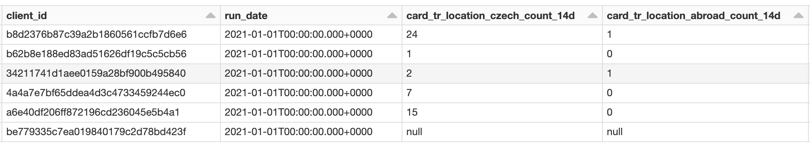

# Developing Features with time windows

Before reading this article, it is recommended to get familiar with [using templates](templates.md).

---

If you need to create the same feature just for a multiple time windows e. g. __Number of repayments made in the last 30, 60 and 90 days__, there is an optimal way to do it.

### Setup

First, helper functions for dealing with time windows need to be imported and variables `run_date` and `time_windows` need to be defined.

For more information about these functions, see the [technical reference](time-windows-technical-reference.md).

A good practice is to define these using [Widgets](../using-widgets.md) but here they are just global variables for simplicity.

```python
from featurestorebundle.windows.windowed_features import windowed, with_time_windows


run_date = dt.date.today().strftime("%Y-%m-%d")
time_windows = ["30d", "60d", "90d"]
```

### Add time window columns

The input DataFrame is passed into the `with_time_windows` function which generates one boolean column `is_time_window_{time_window}` for each `time_window` which indicates whether or not the row in desired time window.

```python
@transformation(read_table("silver.tbl_joined_loans_and_repayments"), display=True)
def joined_loans_and_repayments_with_time_windows(df: DataFrame):
    return (
      with_time_windows(df, "Date", f.lit(run_date), time_windows)
      .select("LoanId", "Date", "InterestRepayment", *[f"is_time_window_{time_window}" for time_window in args.time_windows])
    )
```


### Aggregate all features at once

With time window columns in the DataFrame, it is relatively simple to make the same feature for each time window.
Looping through time windows and adding column aggregations into a list makes it easy to then `group_by` all the features at once.

```python
@transformation(joined_loans_and_repayments_with_time_windows, display=True)
@loan_feature(
    ("interest_repayment_{agg_fun}_{time_window}", "{agg_fun} of interest repayment in a {time_window} period"),
    category="personal",
)
def new_features(df: DataFrame):
  """Get all time windowed columns"""
  agg_cols = []
  for time_window in time_windows:
      agg_cols.extend([
        f.sum(
          windowed(f.col("InterestRepayment"), time_window)
        ).alias(f'interest_repayment_sum_{time_window}')
      ])
  
  """Aggregate all columns"""
  grouped_df = (
    df.groupby("LoanId")
           .agg(
             *agg_cols,
           )
  )
  
  """Return df with run_date"""
  return (
    grouped_df.withColumn('run_date', f.lit(run_date))
  )
```


