# Setting up Azure environment

## Prerequisites
- Subscription with **Owner** permissions
- Sufficient permissions to AAD (Azure Active Directory) - to create app registrations / service principals
- Azure DevOps project with **Project Administrator** permissions

## Best practises

**Subscription per environment**  
We consider as a best practice to have separate subscriptions for dev/test/prod environments.

**Naming of service principals**  
Our recommendation for naming is that the service principal name should reflect purpose and it's permission scope, eg.

`devops-service-connection-to-{subscription-name}`  
`devops-service-connection-to-{subscription}-{resource-group-name}`

**Naming of service connections in DevOps**  
We like to keep name for DevOps service connection same as the name of service principal we are authenticating through.

## Security Architecture
This diagram helps to visualize what is going to be done. It only shows it for dev environment.

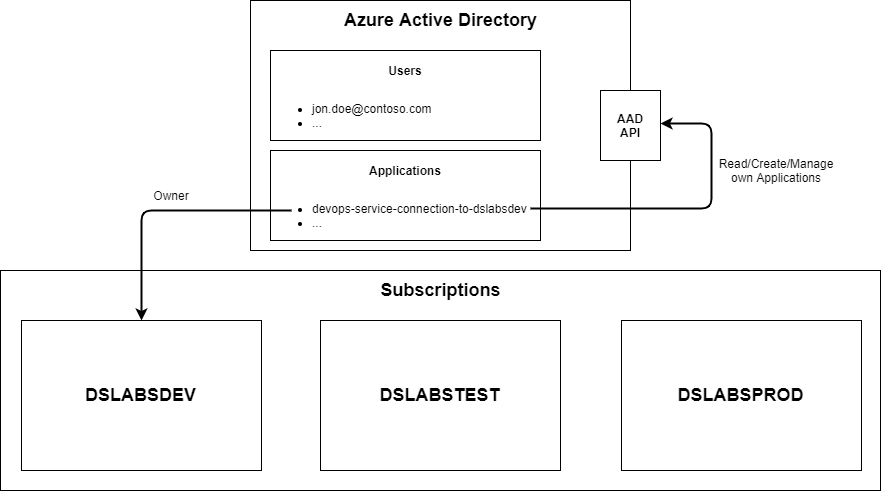

**Notice**
This tutorial describes how to setup **dev** environment. Setup for **test** and **prod** is identical.

## 1. Create service principal in Azure Active Directory

- Go to [Azure portal](https://portal.azure.com)
- Click on Azure Active Directory
- Click on App registrations
- Click on New registration

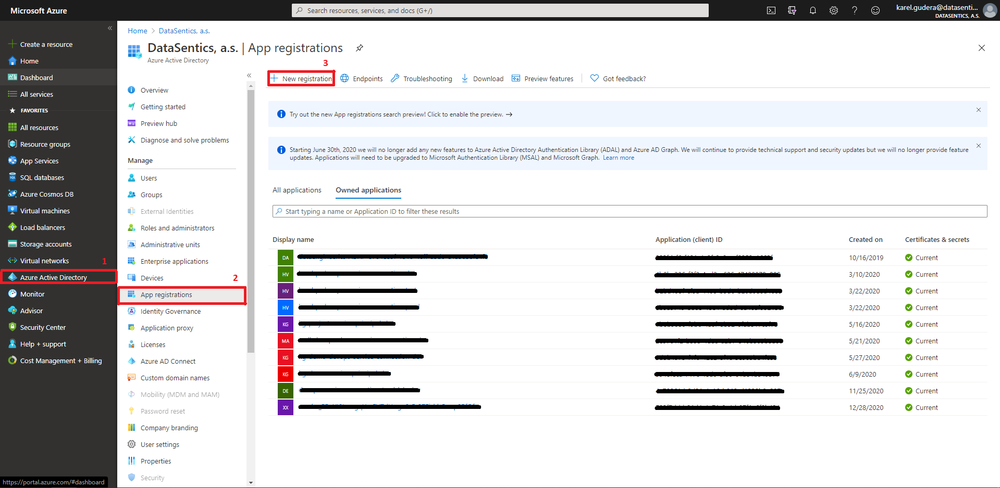

- Fill the name and click Register

In this case the service principal's purpose is to authorize from DevOps to Azure Cloud and the service principal permission scope is to subscription `dslabsdev` hence the name `devops-service-connection-to-dslabsdev`.

- Copy Application ID and store it for later use

**Notice**  
Assigning permission scope for service principal will be done in next steps so don't worry if it doesn't make sense yet.

## 2. Grant service principal permissions to Azure Active Directory API

- Click on API Permissions
- Click on Add a permission
- Click on Microsoft Graph

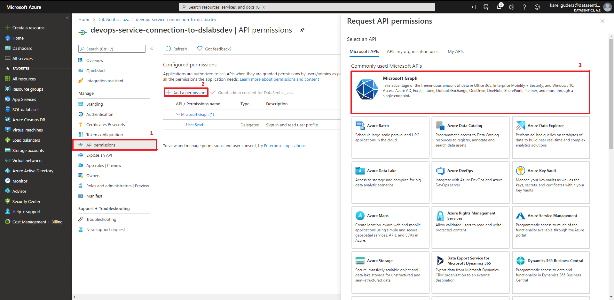

- Click on Application permissions
- Click on Application
- Select Application.ReadWrite.OwnedBy
- Click Add permissions

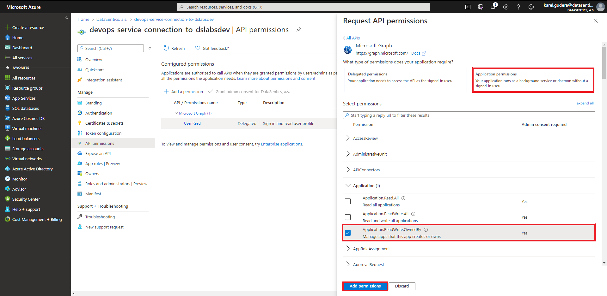

- You need to repeat this process do grant same permission to legacy API. Reason for this that some Microsoft tools still using this legacy API.

- These changes must be approved by some AAD Administrator.

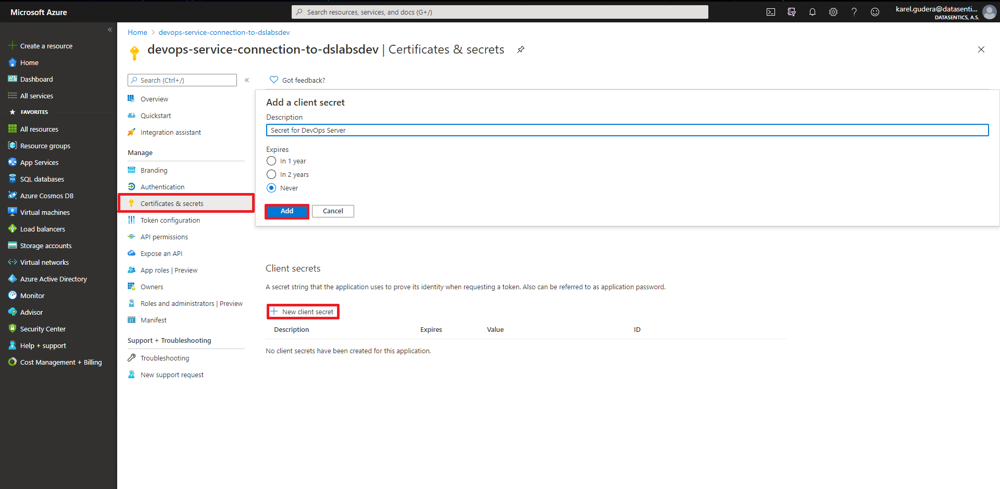

**Security considerations**  
These permissions only allow to read and manage applications created by service principal. So there is no risk that this service principal can be miused to read or modify any other AAD information.

## 3. Generate Application secret
- Click on Certificates & secrets
- Click on New client secret
- Add secret description
- Select expiration - Never
- Click Add

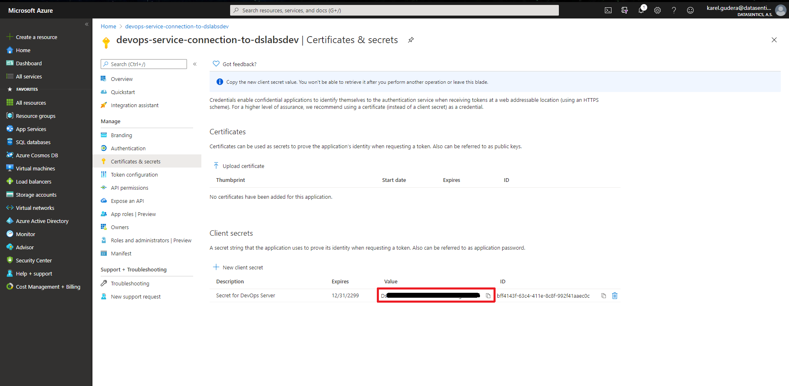

- Copy the secret value and store it for later use

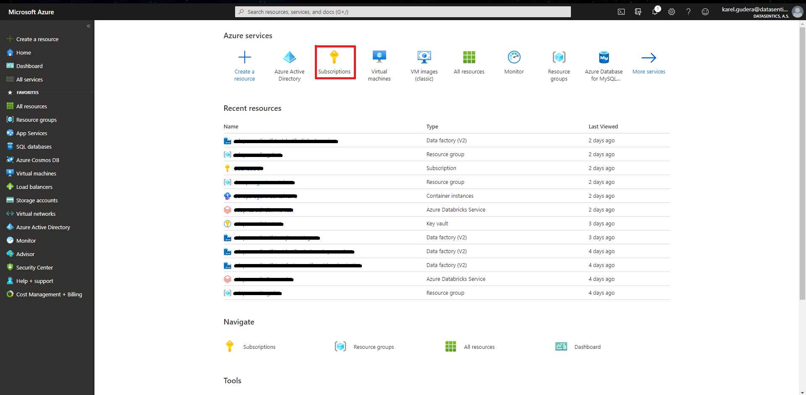

## 4. Grant newly created service principal Owner permissions to your subscription

- In Azure portal click on Subscriptions

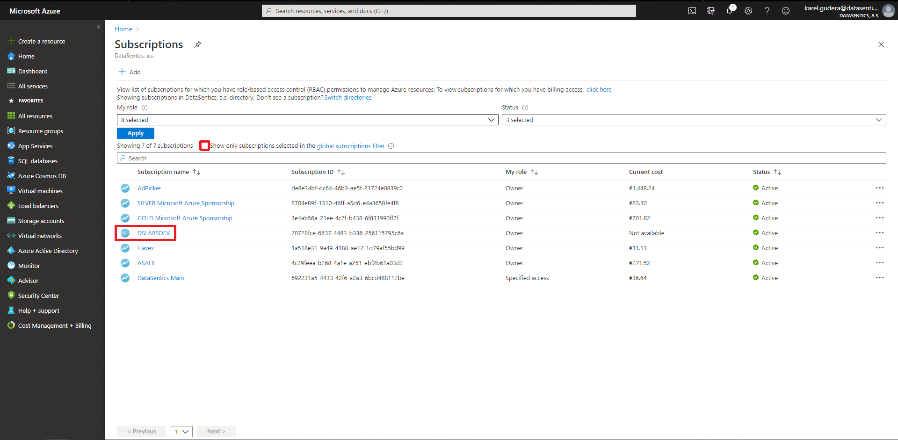

- You might need to uncheck global subscription filter
- Click on your dev subscription

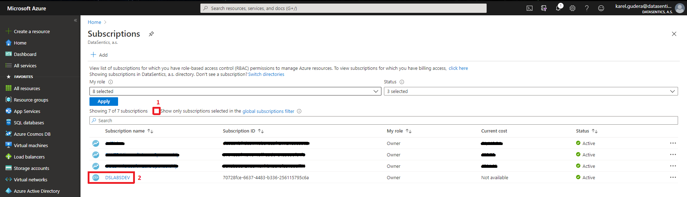

- Click on Access control (IAM)
- Click on Add
- Click on Add role assignment
- Select Owner role
- Find your devops service principal
- Click on that service principal
- Click Save

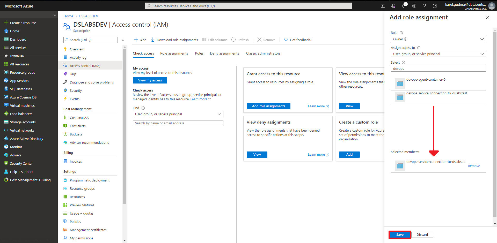

**Security considerations**  
Giving service principal permissions on subscription level might be risky. The Owner/Contributor role allow any creation or deletion of resources in that subscription so if you have another projects/resources in that subscription the service principal might be misused to delete them. Assign permissions at subscription level only if the subscription is empty.

## 5. Create service connection in Azure DevOps

- Go to [any Azure DevOps project](https://dev.azure.com)

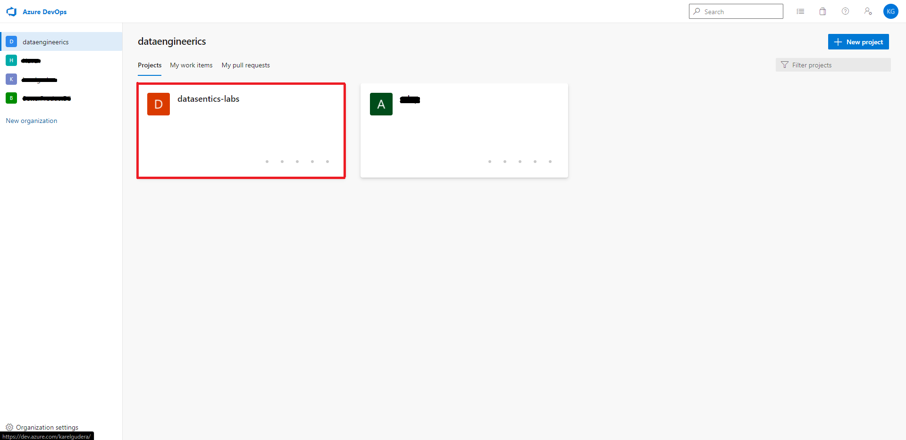

- Click on settings
- Click on Service connections
- Click on New service connection

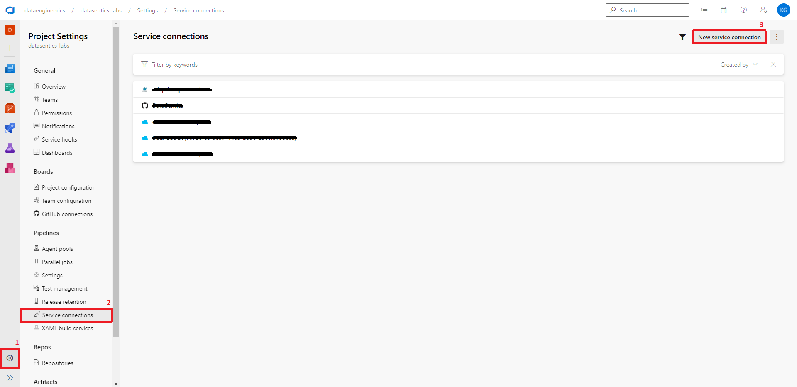

- Select Azure Resource Manager
- Click on Next

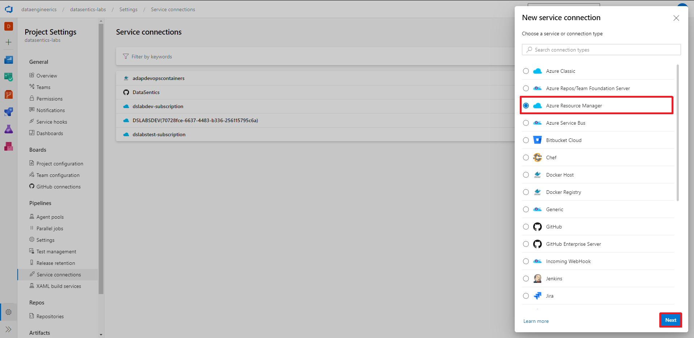

- Select Service principal (manual)
- Click on Next

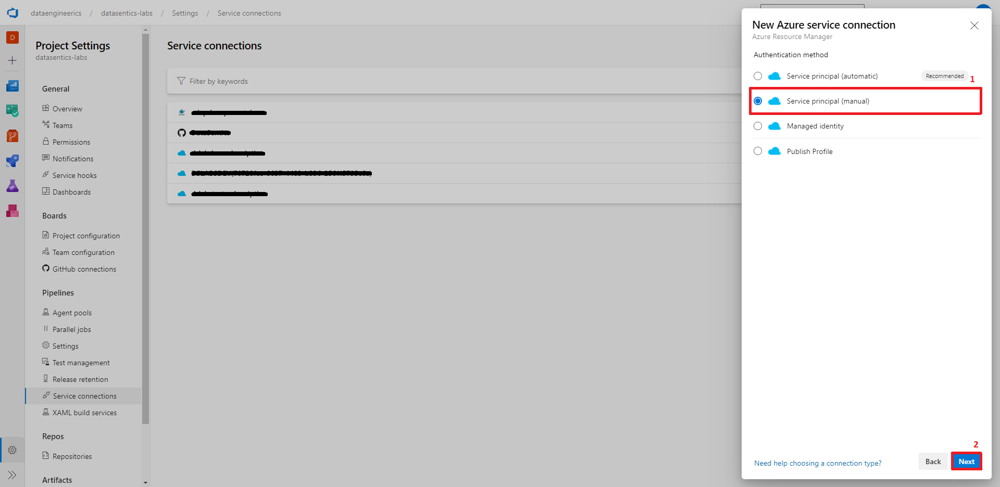

- Fill in approptiate information
- Service Principal ID = Application ID that was stored in previous steps
- Service Principal key = Secret that was stored in previous steps

- You can find Subscription ID in Azure portal under Subscriptions

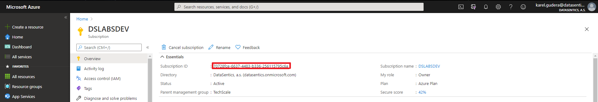

- You can find Tenant ID in Azure portal in Active Directory Overview

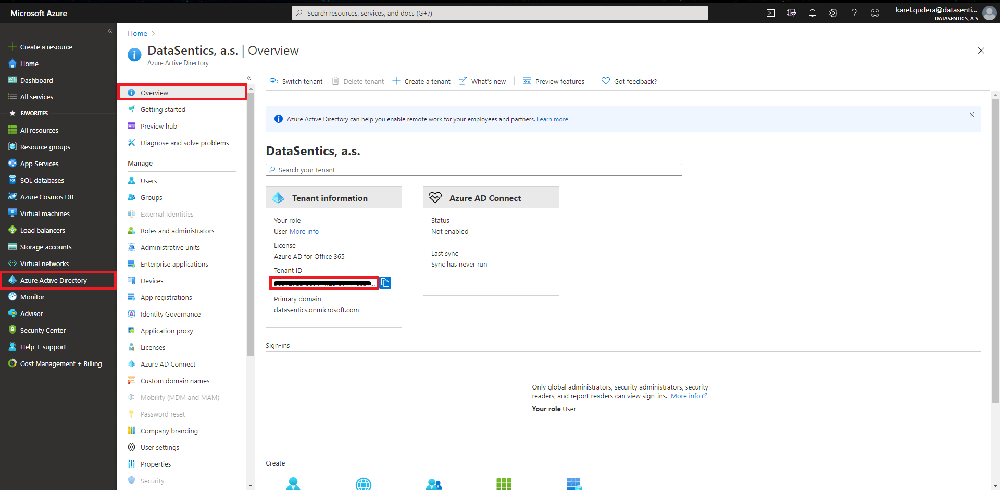

- Sevice connection name should be same as service principal name
- Uncheck Grant access permission to all pipelines
- Click on Verify and save

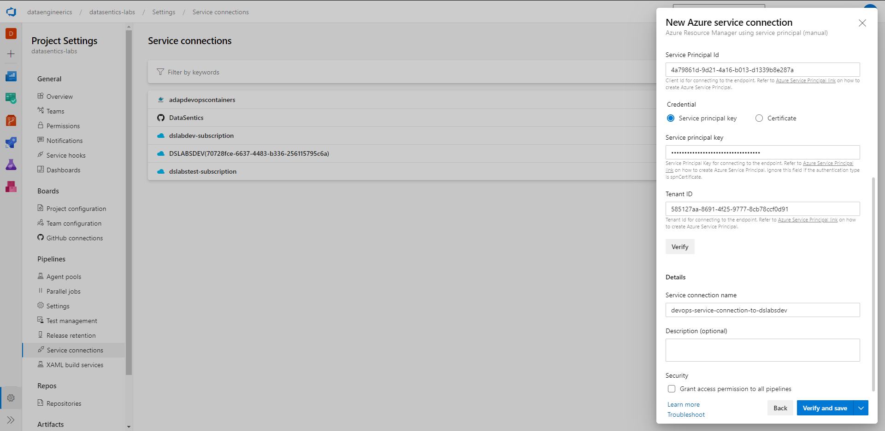

## 6. Create environments

- Create dev/test/prod environments

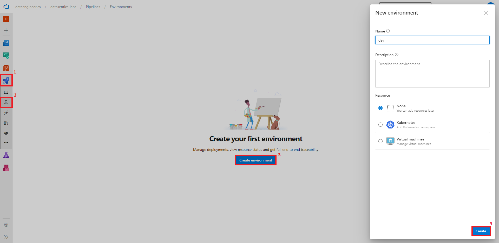

- Set approvals on prod environment

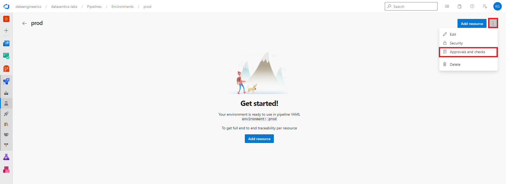
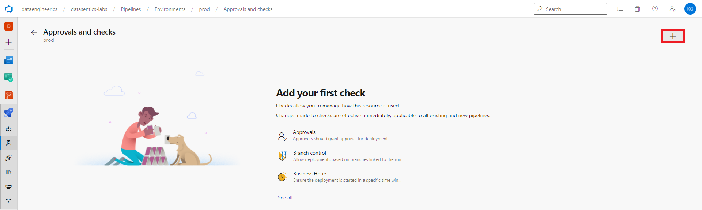
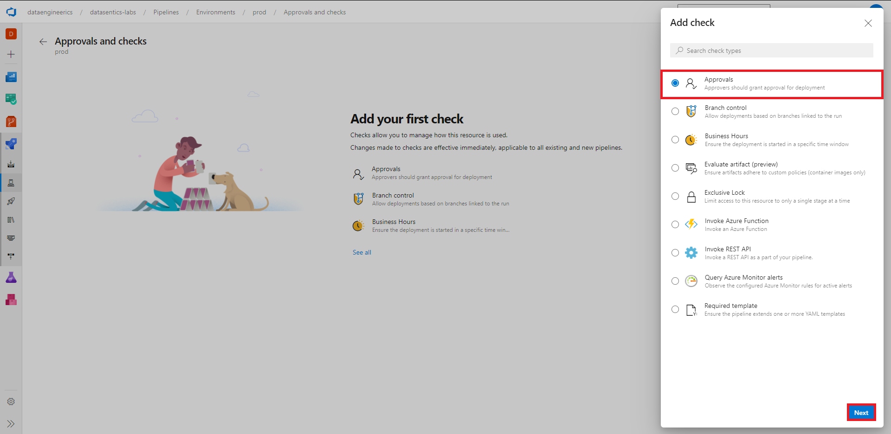
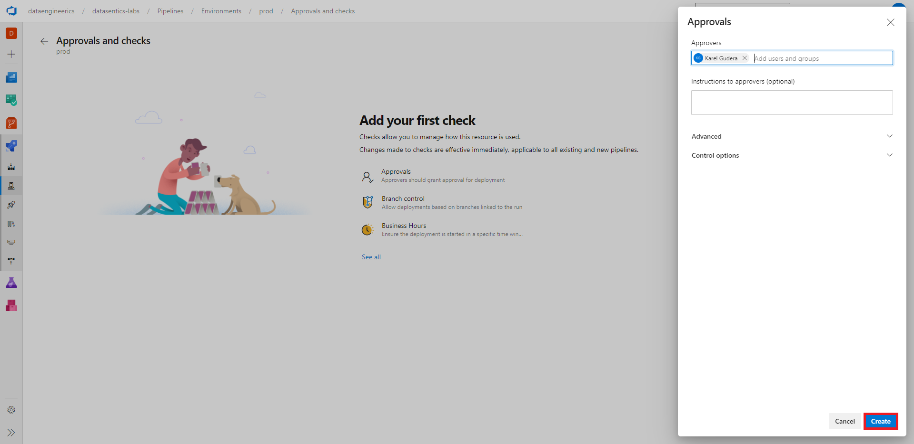

## 7. Make sure that your subscriptions have appropriate resource providers registered

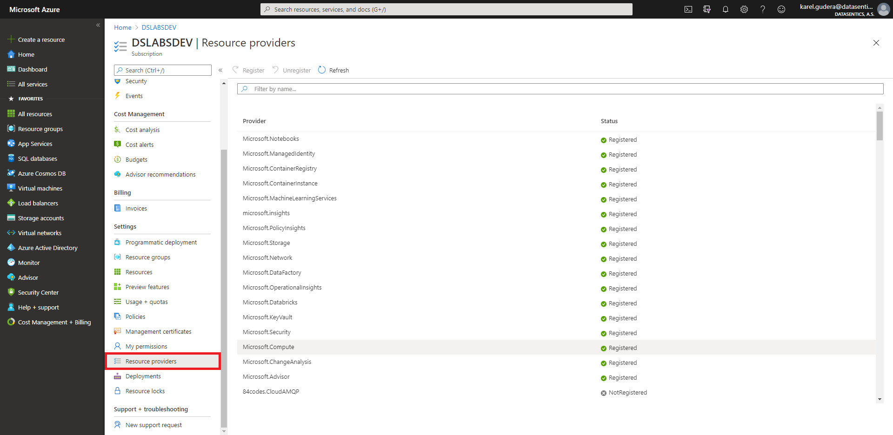
