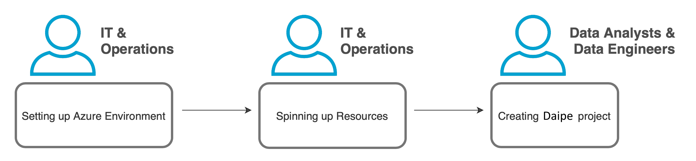

# Process Overview

{: style="width: 750px; padding-left: 5%"}

The schema above describes the full process of AI Suite setup:

1. [Setting up Azure Environment](azure-setup.md) 
2. [Spinning up Data Lake Resources](datalake-resources-setup.md)
3. [Creating Data Pipelines project](data-pipelines-project-setup.md)
4. [Creating Machine Learning project](ml-project-setup.md)
