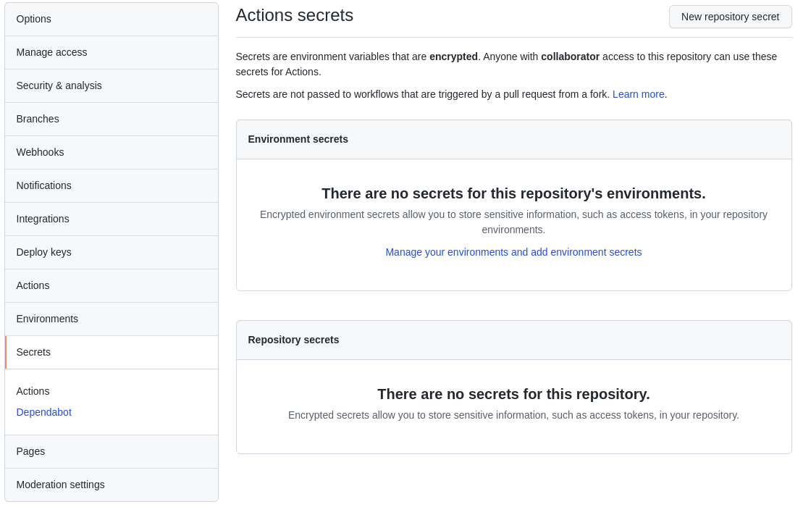
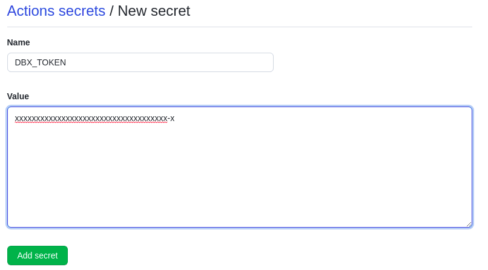
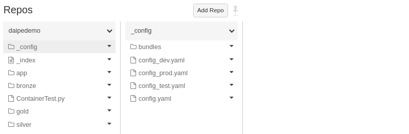
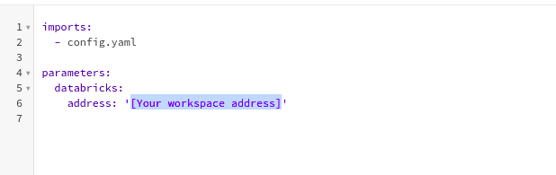

# Setup CI on GitHub

1. In your GitHub project go to Settings > Secrets > New Repository Secret

2. Create DBX_TOKEN and enter an Access Token created in Databricks Workspace at Settings > User Settings > Access Tokens

3. In your code navigate to *src/daipeproject/_config/*

4. In your environment configs (dev, test, prod) change the address to match what workspace you are using for each environment

