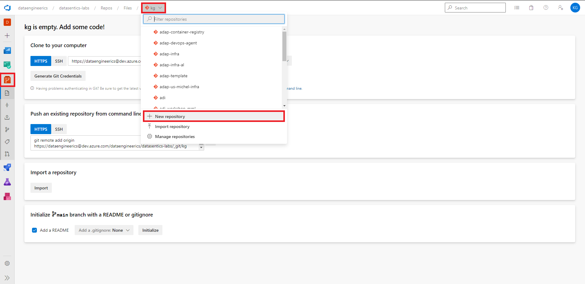
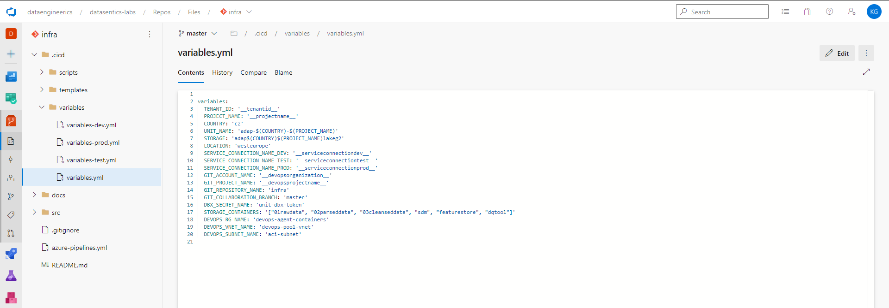
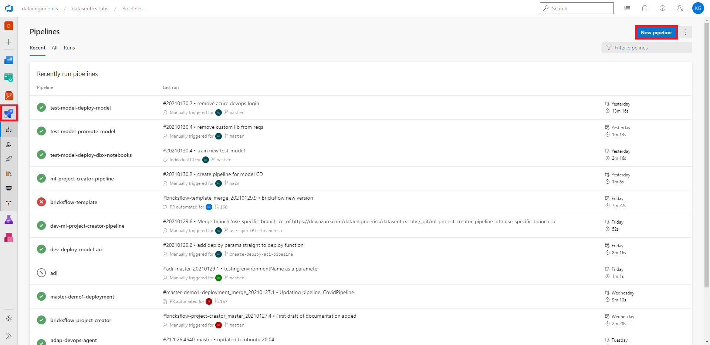
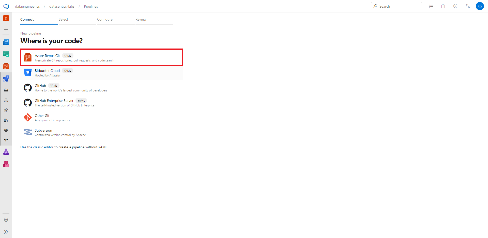
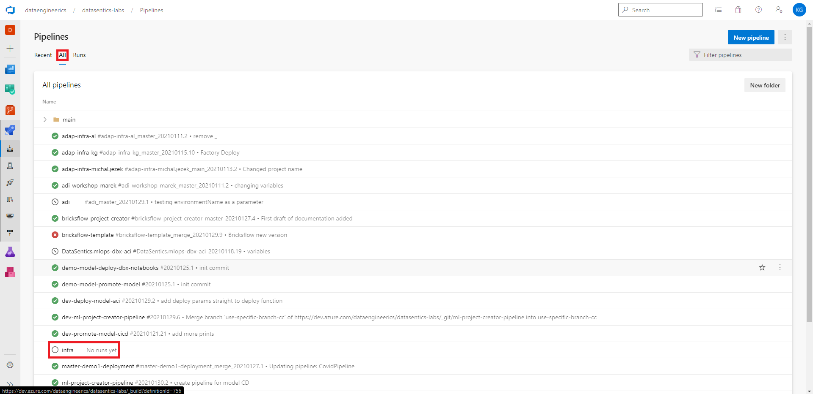
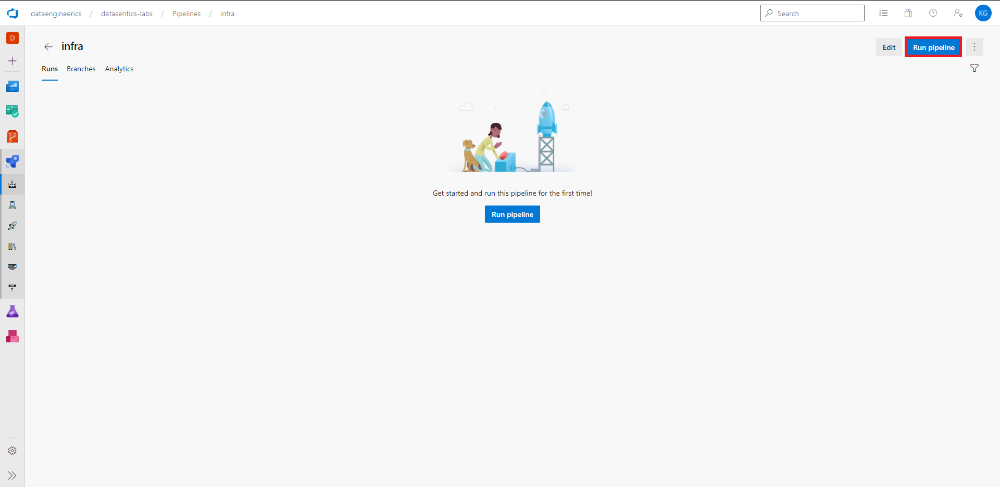

# **ADAP Setup Tutorial**

**Purpose if this document is to provide step by step guide on how to setup ADAP project from scratch.**

## Prerequisites
- Subscription with **Owner** permissions
- Sufficient permissions to AAD (Azure Active Directory) - to create app registrations / service principals
- Azure DevOps project with **Project Administrator** permissions
- GIT installed

## Notice
This tutorial describes how to setup **dev** environment. Setup for **test** and **prod** is identical.

## **Step 1**
**Create service principal in Azure Active Directory.**

- Go to Azure poral (https://portal.azure.com)
- Click on Azure Active Directory
- Click on App registrations
- Click on New registration

- Fill the name and click Register

Our recommendation for naming is that the service principal name should reflect purpose and it's permission scope, eg.

`devops-service-connection-to-{subscription-name}`  
`devops-service-connection-to-{subscription}-{resource-group-name}`

In our case the service principal's purpose is to authorize from DevOps to Azure Cloud and the service principal permission scope is to subscription `dslabsdev` hence the name `devops-service-connection-to-dslabsdev`.

We consider as a best practice to have separate subscriptions for dev/test/prod environments.

- Copy Application ID and store it for later use

**Notice**  
Assigning permission scope for service principal will be done in next steps so don't worry if it doesn't make sense yet.

**Grant service principal permissions to Azure Active Directory API. This is needed because our service principal needs to be able to create other service principals.**

- Click on API Permissions
- Click on Add a permission
- Click on Microsoft Graph
- Click on Application permissions
- Click on Application
- Select Application.ReadWrite.OwnedBy
- Click Add permissions

- You need to repeat this process do grant same permission to legacy API. Reason for this that some Microsoft tools still using this legacy API.

- These changes must be approved by some AAD Administrator.

**Security considerations**  
These permissions only allow to read and manage applications created by service principal. So there is no risk that this service principal can be miused to read or modify any other AAD information.

**Add client secret**
- Click on Certificates & secrets
- Click on New client secret
- Add secret description
- Select expiration - Never
- Click Add
- Copy the secret value and store it for later use

## **Step 2**
**Grant newly created service principal Owner permissions to dev subscription.**

- In Azure portal click on Subscriptions
- You might need to uncheck global subscription filter
- Click on your dev subscription

- Click on Access control (IAM)
- Click on Add
- Click on Add role assignment
- Select Owner role
- Find your devops service principal
- Click that service principal
- Click Save

**Security considerations**  
Giving service principal permissions on subscription level might be risky. The Owner/Contributor role allow any creation or deletion of resources in that subscription so if you have another projects/resources in that subscription the service principal might be misused to delete them. Assign permissions at subscription level only if the subscription is empty.

**Overview**  
To visualize steps done so far check a diagram below. The diagram shows only setup for dev environment. Exact same procedure should be done for test and prod environments, ie. creating service principals `devops-service-connection-to-test`, `devops-service-connection-to-prod`, etc.

## **Step 3**
**Create service connection in Azure DevOps.**

- Go to Azure DevOps project (https://dev.azure.com)
- Click on settings
- Click on Service connections
- Click on New service connection

- Select Azure Resource Manager
- Click on Next
- Select Service principal (manual)
- Click on Next

- Fill in approptiate information
- Service Principal ID = Application ID that was stored in previous steps
- Service Principal key = Secret that was stored in previous steps

- You can find Subscription ID in Azure portal under Subscriptions

- You can find Tenant ID in Azure portal in Active Directory Overview

- Our recommendation for service connection name is to keep it same as Service Principal name
- Uncheck Grant access permission to all pipelines
- Click on Verify and save

## **Step 4**
**Create repository for infrastructure nad import it's code.**

- In Azure DevOps click on repositories
- Click on dropdown menu
- Click on New repository
- Name it e.g. `infra`
- Click Create

- Import code from Datasentics repository TBD.

## **Step 6**
**Go to infra repo and set it's variables.**

The file `.cicd/variables/variables.yml` holds variables that you can use to customize your infrastructure.

Replace the placeholders.

- TENANT_ID - from previous steps
- PROJECT_NAME - to your liking
- SERVICE_CONNECTION_NAME_DEV - devops-service-connection-to-{devsubscription}
- SERVICE_CONNECTION_NAME_TEST - devops-service-connection-to-{testsubscription}
- SERVICE_CONNECTION_NAME_PROD - devops-service-connection-to-{prodsubscription}
- GIT_ACCOUNT_NAME - name of your devops organization
- GIT_PROJECT_NAME - name of your devops project

## **Step 7**
**Create DevOps pipeline for infrastructure build & deployment.**

- In Azure DevOps click on pipelines
- Click on New pipeline

- Select Azure Repos Git

- Select infra repository

- It will automaticaly locate file `azure-pipelines.yml`
- Click Save

- Go back to Azure pipelines
- Click on All
- Click on infra

- Click on Run pipeline

