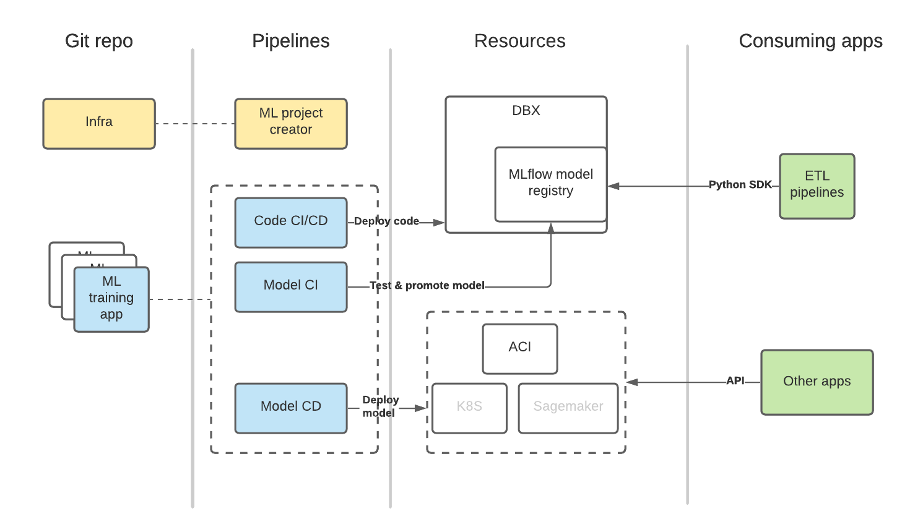

# ML Models Workflow Overview

There are four main components in the architecture: 

* Git repos 
    * repo containing a definition of infrastructure (a prerequisite)
    * ML training application repos, which are automatically created using ML project creator pipeline
* Pipelines
    * ML Project creator pipelines, defined by a `.yaml` contained within the infrastructure repo
    * Code and model CI/CD pipelines, defined by `.yaml` files contained within the ML training app repo
* Resources
    * Development environment, e.g., Databricks (DBX)
    * MLflow server (a required component), which can but don't have to be Databricks managed
    * Optionally, other services such as Azure Container Instances (ACI) or Kubernetes (K8S), which are used to host model in case of online serving
* Consuming applications
    * Those include any applications (an ETL pipeline, web application backend, etc.) which consume the model in an offline or online manner 

