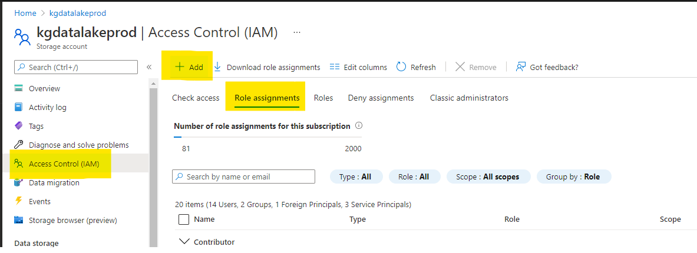
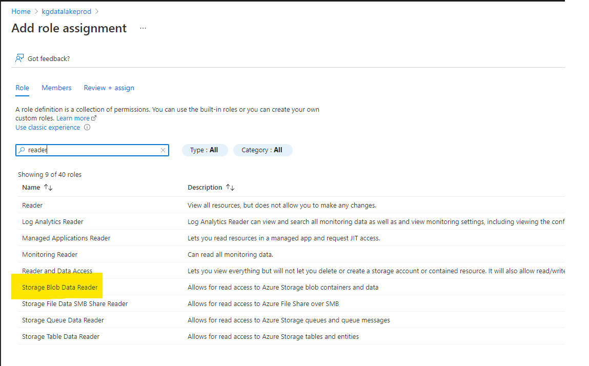
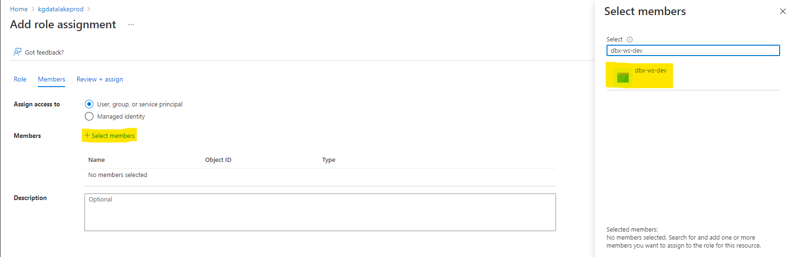

# Read access to production data

Sometimes it's necessary to have production data on development environment.
For example Data Scientist needs to build model on real and full dataset, but you
don't want to give any access to the production environment.

In this section we will show how it can be accomplished on Azure Databricks and
Azure Data Lake Storage gen2, but this principle can generalized on any Databricks
workspace and storage.

## Prerequisites

!!! info "Available since"
    * **datalake-bundle=^1.2.1**

### Development environment

- Databricks workspace with name **dbx-ws-dev**
- Storage Account (gen2) with name **datalakedev**
- Service principal for authentication from Databricks to Storage with same name
  as Databricks workspace **dbx-ws-dev**
  
### Production environment

- Databricks workspace with name **dbx-ws-prod**
- Storage Account (gen2) with name **datalakeprod**
- Service principal for authentication from Databricks to Storage with same name
  as Databricks workspace **dbx-ws-prod**
  
## 1. Setting permissions

So what you want to do is just to give **dev** service principal read access
to the **prod** storage.

- Go to the **datalakeprod** resource in Azure portal and select **Access Control (IAM)**
  and click on **Add**
  
  


- Select **Storage Blob Data Reader** role and click **Next**

  


- Click **Select members** and select **dbx-ws-dev** service principal

  


- Click Review and Assign

## 2. Setting spark configuration

Now we need to tell spark in our **dev** workspace what is our production
storage and how to authenticate to it.

- Go to **dbx-ws-dev** Databricks workspace
- Create cluster
- In Spark Config fill this configuration

```
fs.azure.account.auth.type.datalakeprod.dfs.core.windows.net OAuth
fs.azure.account.oauth.provider.type.datalakeprod.dfs.core.windows.net org.apache.hadoop.fs.azurebfs.oauth2.ClientCredsTokenProvider
fs.azure.account.oauth2.client.endpoint.datalakeprod.dfs.core.windows.net https://login.microsoftonline.com/<tenant_id>/oauth2/token
fs.azure.account.oauth2.client.id.datalakeprod.dfs.core.windows.net <client_id>
fs.azure.account.oauth2.client.secret.datalakeprod.dfs.core.windows.net <client_secret>
```

- Replace **datalakeprod** with name of your **prod** storage account name
- Replace `<tenant_id>` with id of your AAD tenant
- Replace `<client_id>`with application id of your Databricks **dev** principal **dbx-ws-dev**
- Replace `<client_secret>`with application secret of your Databricks **dev** principal **dbx-ws-dev**

Created cluster now should be able to read from production storage.

## 3. Create tables in hive metastore

We need to create production tables in development Databricks hive metastore in order
to call read table. This is manual one time operation.

It's considered as a best practice to separate environment at database level.

- So we create e.g. bronze production database

```sql
CREATE DATABASE IF NOT EXISTS prod_bronze
```

- Then we create production table that points on production storage

```sql
CREATE TABLE IF NOT EXISTS prod_bronze.some_table
USING DELTA
LOCATION 'abfss://container@datalakeprod.dfs.core.windows.net/bronze/some_table.delta'
```

## 4. Configure daipe datalake-bundle

The last step is to configure daipe to read from production storage.

- Go to `src/_config/config.yaml` and add tables section to parameters
- In this section you can override the database that will be read from
- This can be done for each table separately

```yaml
parameters:
  datalakebundle:
    tables:
      bronze.some_table:
        db_name: "prod_bronze"
```

- You can now read the table using daipe decorator function as you are used to

```python
# will result in spark.read.table("prod_bronze.some_table")
@transformation(read_table("bronze.some_table"))
def read_some_table(df: DataFrame):
    return df
```

- If you try to write same table you have configured to read from production it
  should fail with permission error
  
```python
# will result in 403 permission error
@transformation(something)
@table_append("bronze.some_table")
def write_some_table(df: DataFrame):
    return df
```

!!! warning
   Make sure you have correct permissions set, datalake-bundle does not respond
   for that in any way.
