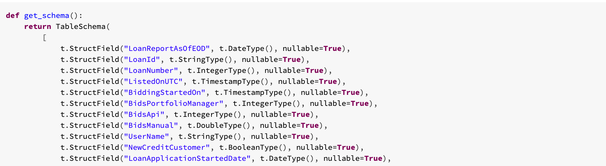

### Version 1.1

- Support for DBR 8.x
- __New__: It is now possible to use Daipe without Databricks on whatever Spark environment or even without a Spark just using Pandas.
- It is no longer necessary to define tables in a local environment, YAML config is __optional__. Local environment is only necessary for the initial setup of the project
Command `datalake:table:create-missing`  has been removed, because it is no longer possible to rely on the tables being defined in YAML config
- __New__: Functions such as `read_table()` can be used as arguments for decorators, which completely replaces the functionality of `@data_frame_loader`, see docs. Example:
```python
# Old Daipe
@data_frame_loader(display=True)
def my_transformation(spark: SparkSession, dbutils: DbUtils):
    mywidget = dbutils.widgets.text(...)
    return spark.read.table("my_database.my_table")
```
```python
# New Daipe
@transformation(read_table("my_database.my_table"), display=True)
def my_transformation(df: DataFrame, dbutils: DbUtils):
    mywidget = dbutils.widgets.text(...)
    return df
```
- Decorator `@data_frame_saver` has been removed in favor of the following new decorators.
- __New__: Decorator `@table_overwrite` which overwrites all data in a table with the data from a DataFrame, see [docs](data-pipelines-workflow/technical-docs/#read_table).
- __New__: Decorator `@table_append` which appends the from a DataFrame to a table, see [docs](data-pipelines-workflow/technical-docs/#table_append).
- __New__: Decorator `@table_upsert` which updates existing data based on `primary_key` and inserts new data, see [docs](data-pipelines-workflow/technical-docs/#table_upsert).
- __Change__: Schema is no longer loaded automatically from the schema.py file in the notebook folder. Now the schema can be defined inside the notebook as well as imported from a separate file, see [docs](data-pipelines-workflow/technical-docs/#table_schema) and example:

{: style="width: 850px; padding-left: 3%"}

- __New__: Schema now allows you to define a primary_key (used for `@table_upsert` ), partition_by and tbl_properties , see [docs](data-pipelines-workflow/technical-docs/#table_schema).
- __New__: Schema will be generate for you if you do not provide it to the `@table_*` decorators see example:

{: style="width: 850px; padding-left: 3%"}

- Schema checking output greatly improved. Schema diff example:

{: style="width: 500px; padding-left: 3%"}

- `console datalake:table:delete` renamed to `console datalake:table:delete-including-data`
