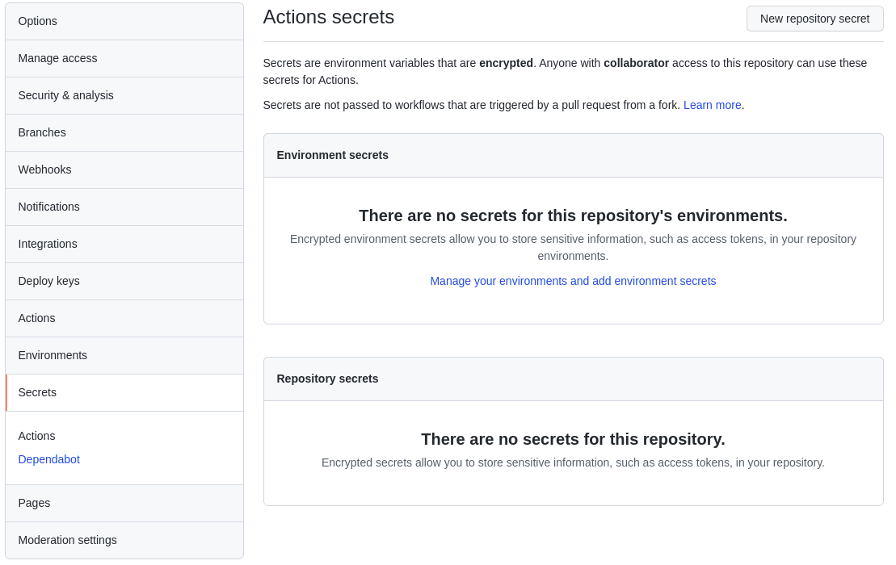

# Setup CI on GitHub

1. In your GitHub project go to Settings > Secrets > New Repository Secret

2. Create DBX_URL secret and enter your Databricks Workspace address

3. Create DBX_TOKEN and enter an Access Token created in Databricks Workspace at Settings > User Settings > Access Tokens

