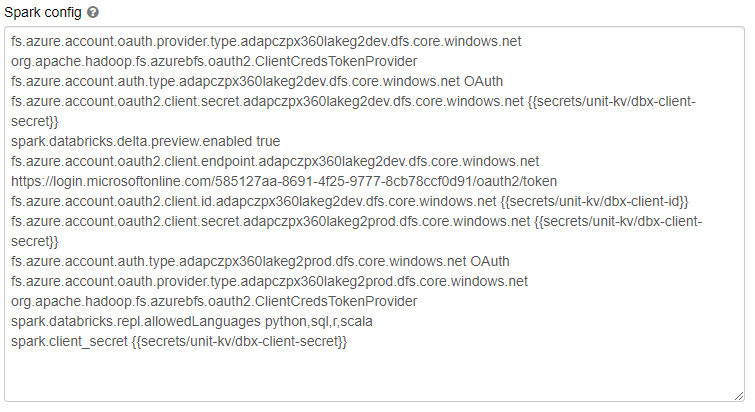

# Storage connection setup

!!! info "Prerequisites"
      - databricks-bundle at version 1.3.0 or higher

## Summary
We are moving from setting up storage connection on each cluster individually to a single setup in a YAML config.

## Old way
Formerly the spark config had to be set up directly on each cluster (in Compute > *select cluster* > Advanced options):


## New way
Add a config in following format to your config_*env*.yaml files (you can also use config variables as usual): 
```yaml
parameters:
  databricksbundle:
    storages:
      dev:
        type: azure_gen2
        tenant_id: "xxxxxxxxx"
        storage_name: "xxxxxxxxxdev"
        client_id:
          secret_scope: unit-kv
          secret_key: dbx-client-id
        client_secret:
          secret_scope: unit-kv
          secret_key: dbx-client-secret
      test:
        type: azure_gen2
        tenant_id: "xxxxxxxxx"
        storage_name: "xxxxxxxxxtest"
        client_id:
          secret_scope: unit-kv
          secret_key: dbx-client-id
        client_secret:
          secret_scope: unit-kv
          secret_key: dbx-client-secret
      prod:
        type: azure_gen2
        tenant_id: "xxxxxxxxx"
        storage_name: "xxxxxxxxxprod"
        client_id:
          secret_scope: unit-kv
          secret_key: dbx-client-id
        client_secret:
          secret_scope: unit-kv
          secret_key: dbx-client-secret
```
