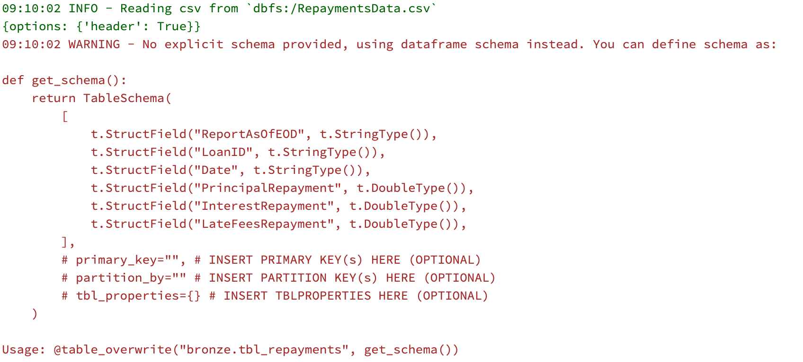

# Using explicit table schema

Table schema can be easily created using the TableSchema class:

```python
def get_schema():
    return TableSchema(
        [
            t.StructField("ReportAsOfEOD", t.DateType(), True),
            t.StructField("LoanID", t.StringType(), True),
            t.StructField("Date", t.DateType(), True),
            t.StructField("PrincipalRepayment", t.DoubleType(), True),
            t.StructField("InterestRepayment", t.DoubleType(), True),
            t.StructField("LateFeesRepayment", t.DoubleType(), True),
        ],
        primary_key=["LoanID", "Date"],
        # partition_by = "Date"
    )
```

For more details see the [TableSchema reference](table-schema.md).

## Selecting all fields from the schema before writing them into table:

```python
@transformation(read_csv("loans.csv"))
@table_overwrite("bronze.tbl_loans", get_schema())
def save(df: DataFrame):
    return (
        df.select(get_schema().fieldNames())
    )
```

## Schema autosuggestion

When using `@table_*` decorators __without__ an explicit schema,...

```python
@transformation(
    read_csv("/RepaymentsData.csv", options=dict(header=True)),
)
@table_overwrite("bronze.tbl_repayments")
def load_csv_and_save(df: DataFrame):
    return df
```

...Daipe raises a __warning__ and generates a schema based on the DataFrame for you. 

{: style="width: 80%"}

## Schema checking

When using `@table_*` decorators __with__ an explicit schema, Daipe checks if the schemas match and raises an __Exception__ if they do not.

It also shows a difference between the schemas so you can easily fix the problems.


