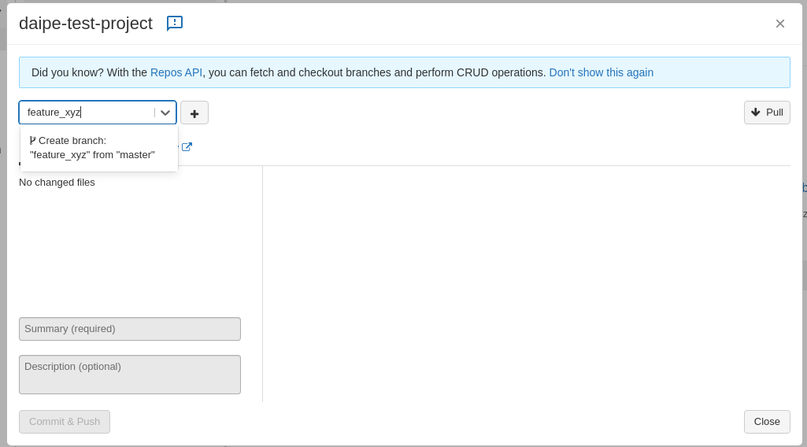
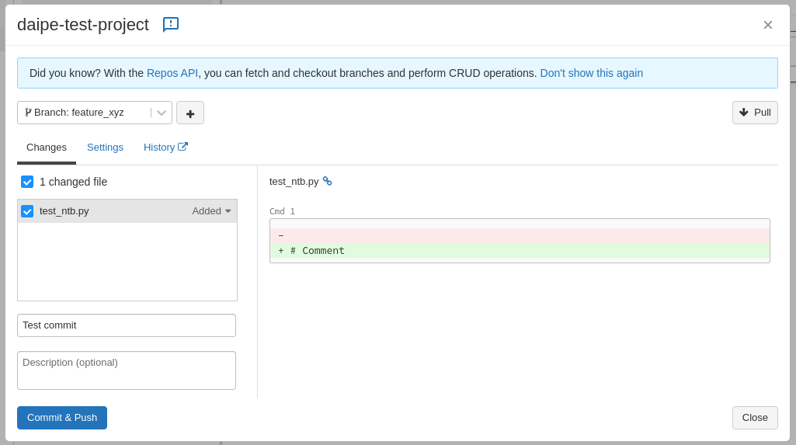
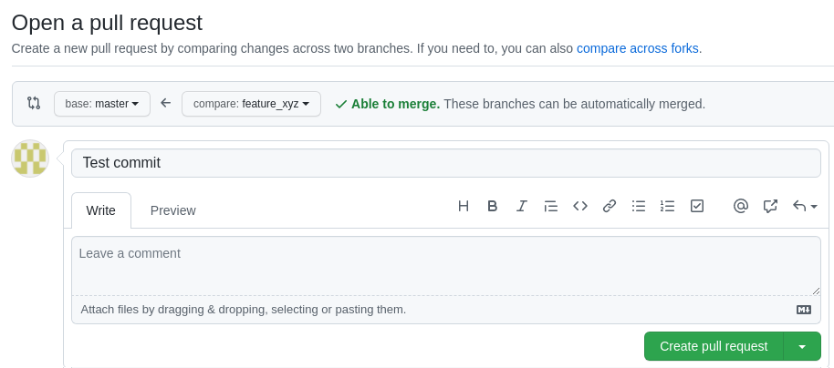
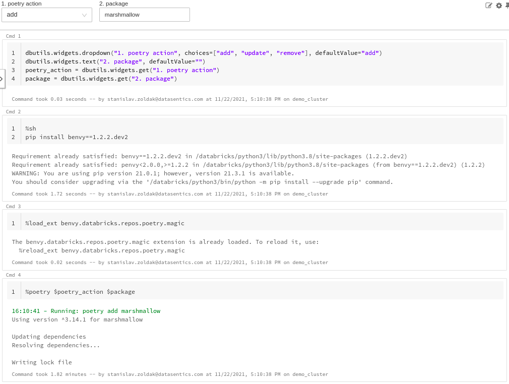
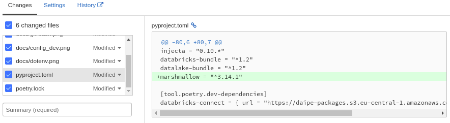
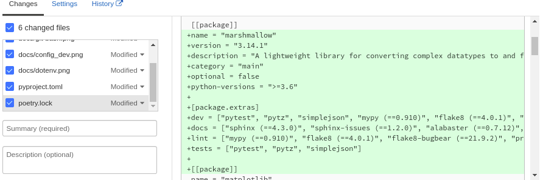

# Git workflow in Databricks

!!! warning
    If you are still using Daipe in Workspace / locally, [use this guide instead](working-with-git-local.md).

!!! info "Prerequisites"
      - Enable 'Files in Repos' in your Databricks workspace at *Settings -> Admin Console -> Workspace Settings*
      - Set up a GitHub [personal access token](https://docs.github.com/en/authentication/keeping-your-account-and-data-secure/creating-a-personal-access-token)
         - In your Databricks workspace at *Settings -> User Settings -> Git Integration* select GitHub as a provider and use your new token here

## Create feature branch and work on it
Open the Git menu (branch name next to the repo name, or right click) and checkout a new feature branch:

## Commit your work to GIT repository
After making changes to your feature branch you can commit the changes in the Git menu:

## Merging the feature branch with your main branch
After you are done with the changes, open a Pull Request into your main branch back in your repository on GitHub:

### Adding, updating or removing a project dependency
To add, update or remove a dependency you need to:

1. Open a *dbx_poetry* notebook in the root of your project.
2. Run the Cmd 1 to show Widgets.
3. Select the add/update/remove action in the first widget and the desired package in the second.
4. Run the rest of the commands
5. If you rerun `%run bootstrap` in your notebooks, the new dependencies should be available
6. The updated project should then be pushed to a central repository so that other team members can pull it and have the same dependencies.

## Example
- Ran dbx_poetry notebook as described above

- Expected diff in pyproject.toml on commit

- Expected diff in poetry.lock on commit

